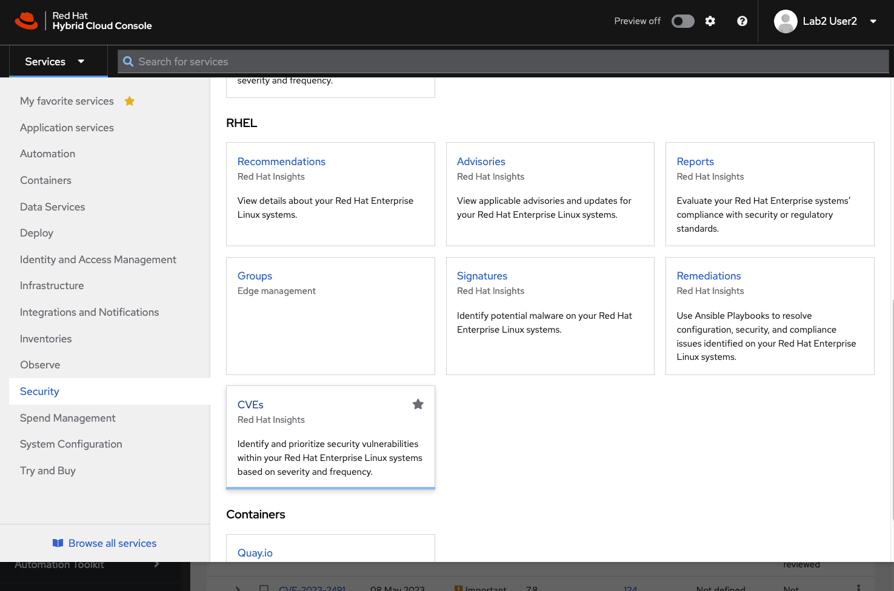

>_NOTE:_ To make the inline images larger, expand this window.


There is a tab open inside of the lab environment for the Red Hat Hybrid Cloud Console, click on that, and you will be brought to the login page.

>_NOTE:_ This will open an additional browser window or tab. Also note: If your browser already has a session for the Hybrid Cloud Console, you may need to open a new private window or tab in order to complete the following tasks

Login using the credentials below:

Login:

```bash
rhel-df93
```

Password:

```bash
Redhat1!
```


Once you are logged in, using the credentials provided above, use the _Services_ drop-down menu to navigate to *Services -> Security -> CVEs (Under the RHEL heading)



