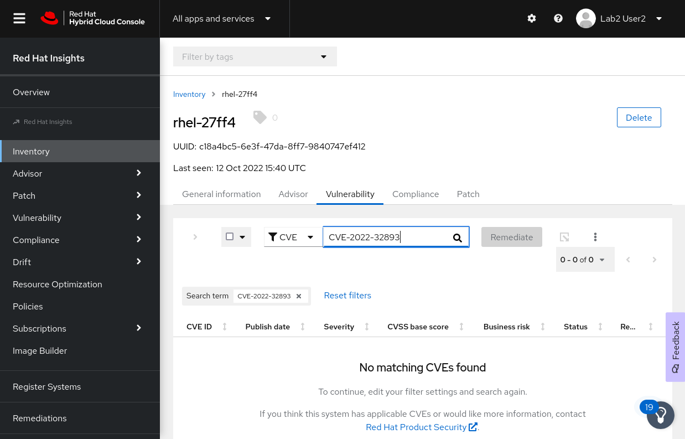

Now, let's make sure insights has reported that the issue has been resolved.  Insights will do this periodically, but in the interest of time let's force a sync. You can do this simply by running `insights-client`.

```bash
insights-client
```

<pre class=file>
Starting to collect Insights data for rhel-27ff4
Uploading Insights data.
Successfully uploaded report from rhel-27ff4 to account 6227255.
View details about this system on console.redhat.com:
https://console.redhat.com/insights/inventory/c18a4bc5-6e3f-47da-8ff7-9840747ef412
</pre>

Once that completes, head back over the the Cloud Console, and into Insights.  Find our host in the inventory again, and go to the vulnerabilities tab.

>Note: If you had your host open from our previous exercise you may need to refresh the page, in order to see the most recent CVE list.

Now if we filter by the CVE id, and search for the CVE we just remediated, it should be gone from the list.





