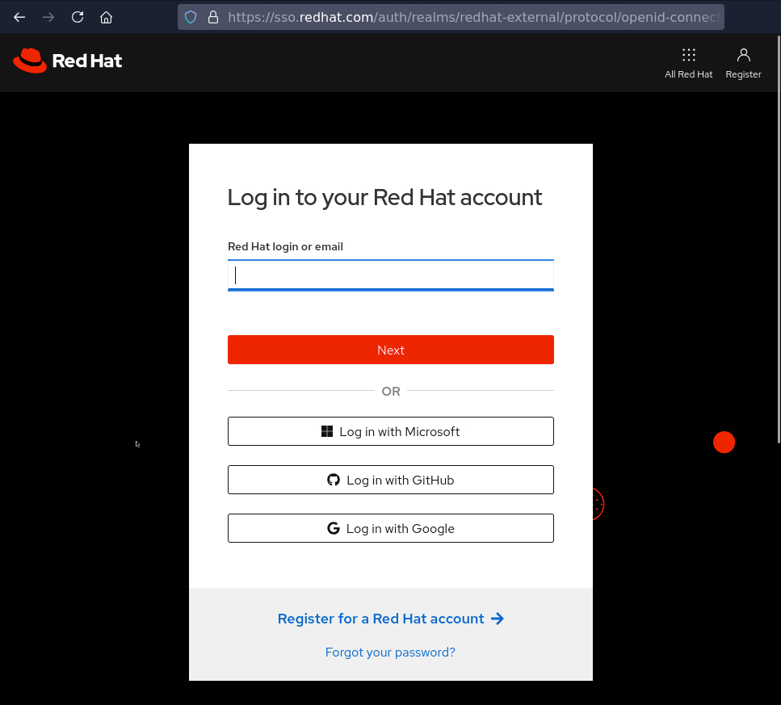
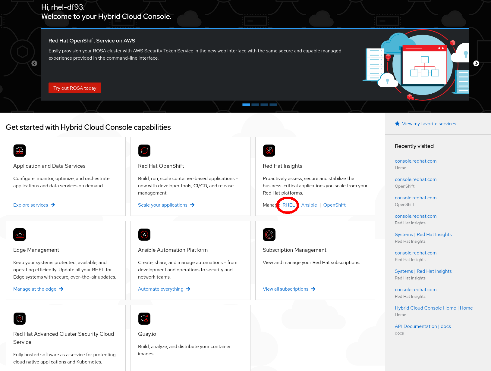

>_NOTE:_ To make the inline images larger, expand this window.


Click the hyperlink or browse to [cloud.redhat.com](https://cloud.redhat.com) to access Red Hat's software as a service web portal.

>_NOTE:_ This will open an additional browser window or tab.

Click the _Log in to the console_ button.



Login using the credentials below:

Login:

```bash
rhel-df93
```

Password:

```bash
Redhat1!
```


Once you are logged in using the credentials provided above, navigate to _RHEL_ inside the _Red Hat Insights_ box.


