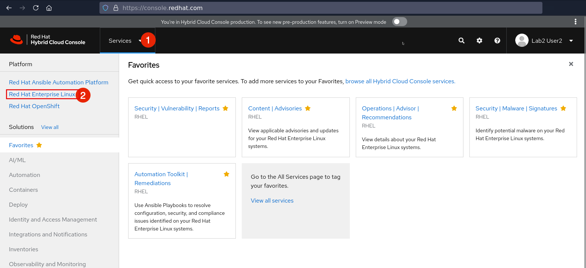

>_NOTE:_ To make the inline images larger, expand this window.


The browser window opens [console.redhat.com](https://console.redhat.com) to access Red Hat's software as a service web portal.

Login using the credentials below:

Login:

```bash
rhel-df93
```

Password:

```bash
Redhat1!
```

Once you are logged in using the credentials provided above, navigate to _Red Hat Enterprise Linux_ inside the _Services_ drop-down, under _Platform_.


