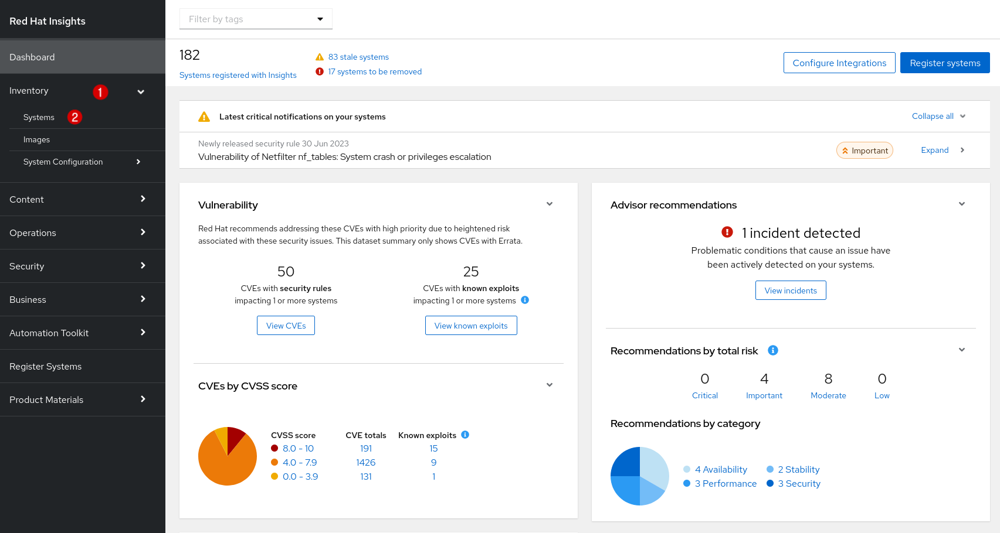

Now that you have opened Red Hat Insights for Red Hat Enterprise Linux, you will see a summary dashboard of all systems registered to your organization.

For the purposes of this exercise, you are working with a single machine registered to Insights and we will focus on the Advisor recommendations available for that host.  Click on the _Inventory_ link on the left navigation bar. Then, click on _Systems_.

Once you are on the Inventory page, find and click your hostname to pull up information for your individual machine.  Recall in a previous step you found your machine hostname with the `hostname` command.

>_NOTE:_ Your host may not be the first one listed, as depicted in the graphic above.  You may find it necessary to use the _Find system by name_ search function at the top of the list of hosts to more quickly find your system.

>_NOTE:_ If you do not see your host in the inventory list, it may be necessary to re-run the `insights-client` command on your RHEL host.