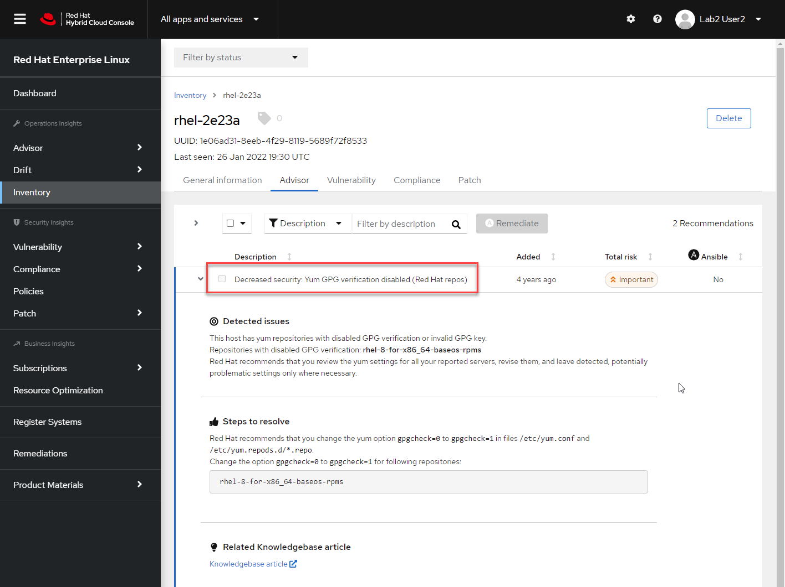

# Reviewing system Insights

After selecting your system from the Inventory page and reviewing some
overall data about it, click on the _Advisor_ tab to view the Red Hat
Insights data that applies to this host.

There may be several recommendations listed for this system.  Scroll down through the
list until you reach the one entitled _Decreased security: Yum GPG verification disabled (Red Hat repos)_

From the _Detected issues_ section of the recommendation, you can see that this recommendation
is being triggered by the machine running with a GPG verification disabled for the `rhel-8-for-x86_64-baseos-rpms` software repository.

In the _Steps to resolve_ section of the recommendation, step-by-step
guidance on how to resolve the issue is provided.  In this case, to change the `gpgcheck=0` key-value pair to `gpgcheck=1`.

