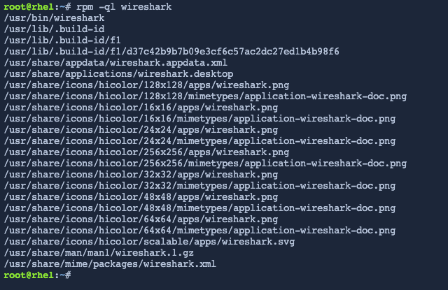
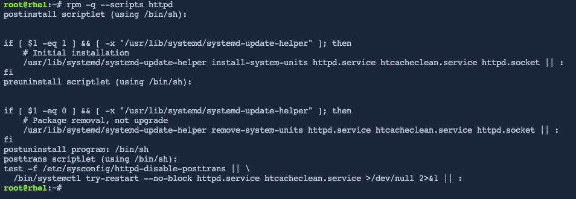
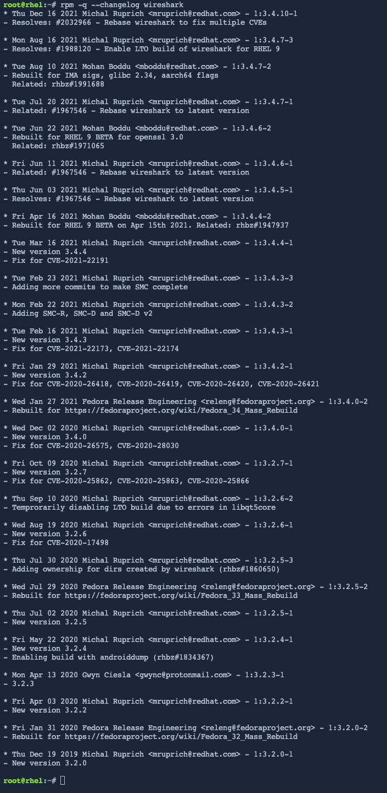

DNF is the standard package manager, but this does not mean that RPM is obsolete. Detailed queries can be carried out using RPM using the query option (`-q`). This step will walk you through three examples of how to use this option.

## Listing files installed by a package

You can combine the `-q` option with the list option (`-l`) to display all of the files that are installed by a specific package. This information is hidden by default to keep the package installation process simple, but it is often useful to know where specific files are located.

```bash
rpm -ql wireshark
```

<a href="#1">
 
</a>

<a href="#" class="lightbox" id="1">
 
</a>

Now you can see that the Wireshark application is located at `usr/bin/wireshark`.

## Listing installation scripts

Some packages run scripts to finish up their installation process. The `--scripts` option can be used in combination with `rpm -q` to return the contents of these postinstall scripts for a specific package. Wireshark does not actually have any postinstall scripts, so instead try this command with the __httpd__ package.

```bash
rpm -q --scripts httpd
```

<a href="#2">
 
</a>

<a href="#" class="lightbox" id="2">
 
</a>

The output shows a script that creates a preset for the __httpd__ service behind the scenes when the package is installed.

## Showing changelog

Specifying `--changelog` with `rpm -q` will display what has recently been changed in a package.

```bash
rpm -q --changelog wireshark
```

<a href="#3">
 
</a>

<a href="#" class="lightbox" id="3">
 
</a>

The next step will walk you through another use for `rpm`, file validation.

<style>
.lightbox {
  display: none;
  position: fixed;
  justify-content: center;
  align-items: center;
  z-index: 999;
  top: 0;
  left: 0;
  right: 0;
  bottom: 0;
  padding: 1rem;
  background: rgba(0, 0, 0, 0.8);
}

.lightbox:target {
  display: flex;
}

.lightbox img {
  max-height: 100%;
}
</style>
