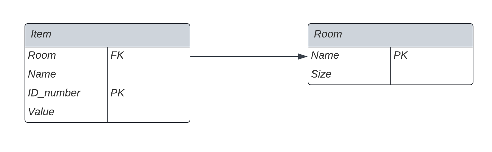

To understand how we organize databases, it is helpful to understand the definition of a relational database, a relational database management system, and SQL. For an overview, [check out this helpful article.](https://www.codecademy.com/article/what-is-rdbms-sql)

In this step, you will be challenged to complete a task, and we will provide you with guidance to help you along!

# Challenge: Make a database to organize the items in your home

To record all of the items in your home, there are many ways to organize the database. For our lab, we will use this database design:

In this diagram:
* Each item has a name, an ID number, a value, and a location (room) where it is stored. The location (room) of the item is a foreign key because it relates to the Room entity. The ID number is auto-incrementing and is the primary key for items.
* Each room has a name, which is the primary key for the room entity. Each room also has a Size field to store the area.

Now that you are familiar with the database you will build, you are ready to start creating tables.

Next, create the table for `Room` with the following command:
```sql,run
CREATE TABLE Room(
Name varchar (255) NOT NULL,
Size int,
PRIMARY KEY (Name)
);
```

Now create the table for `Item`.
```sql,run
CREATE TABLE Item(
  Room varchar(255) NOT NULL,
  Name varchar(255),
  ID_number int NOT NULL AUTO_INCREMENT,
  Value DOUBLE,
  PRIMARY KEY(ID_number),
  FOREIGN KEY (Room) REFERENCES Room(Name)
);
```

Finally, run the following command to insert some entries into your database. In the real world, you will customize the entries depending on your needs, but for the purpose of demonstration, run this MySQL command:
```sql,run
INSERT INTO Room(Name, Size)
VALUES('Living Room',500);
INSERT INTO Room(Name, Size)
VALUES('Bedroom',200);
INSERT INTO Room(Name, Size)
VALUES('Kitchen',400);
INSERT INTO Item(Room, Name, Value)
VALUES('Kitchen','Oven', 1000);
INSERT INTO Item(Room, Name, Value)
VALUES('Kitchen','Microwave',100);
INSERT INTO Item(Room, Name, Value)
VALUES('Bedroom','Bed',500);
INSERT INTO Item(Room, Name, Value)
VALUES('Living Room','Chair',500);
```

In the next step, you'll be able to see what you have just built! First, quit your MySQL session by running the following command:
```sql,run
quit;
```