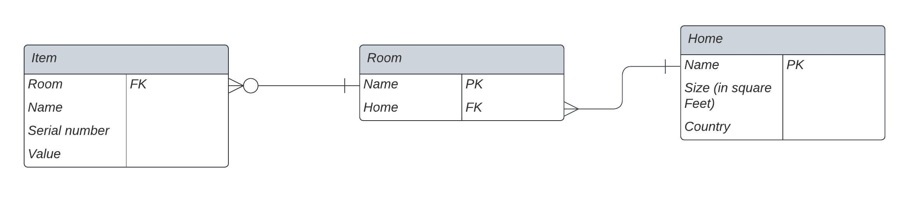

To understand how we organize databases, it is helpful to understand the definition of a relational database, a relational database management system, and SQL. For an overview, [check out this helpful article.](https://www.codecademy.com/article/what-is-rdbms-sql)

In this step, you will be challenged to complete a task, and we will provide you with guidance to help you along!

# Challenge: Make a database to organize the items in your home

To record all of the items in your home, there are many ways to organize the database. For our lab, we will use this database design:

In this diagram:

* Each item has a name, a serial number, a value, and a location (room) where it is stored. The location (room) of the item is a foreign key because it relates to the Room entity. Each item relates to one Room entity.
* Each room has a name, which is the primary key for the room entity. Each room is also inside a home, and home is a foreign key because it relates to the Home entity. Each room relates to 0 or more Item entities, and each room relates to one Home entity.
* Each home has a name, which is the primary key for the home entity. Each home has a size and a country in which it is located. Each home relates to many room entities.

For help understanding the meaning of database diagrams, [check out this article.](https://www.lucidchart.com/pages/ER-diagram-symbols-and-meaning)

Now that you are familiar with the database you will build, you are ready to start creating tables.

First, create the table for `Home` with the following command
```sql
CREATE TABLE Home(
  Name varchar(255) NOT NULL,
  Size int,
  Country varchar(255),
  PRIMARY KEY(Name)
);
```
Next, create the table for `Room` with the following command:
```sql
CREATE TABLE Room(
Name varchar (255) NOT NULL,
Home varchar (255) NOT NULL,
PRIMARY KEY (Name),
FOREIGN KEY (Home) REFERENCES Home(Name)
);
```

Now create the table for `Item`.
```sql
CREATE TABLE Item(
  Room varchar(255) NOT NULL,
  Name varchar(255),
  ID_number int NOT NULL AUTO_INCREMENT,
  Value DOUBLE,
  PRIMARY KEY(ID_number),
  FOREIGN KEY (Room) REFERENCES Room(Name)
);
```

Finally, run the following command to insert some entries into your database. In the real world, you will customize the entries depending on your needs, but for the purpose of demonstration, run this MySQL command:
```sql
INSERT INTO Home (Name, Size, Country)
VALUES('City Apartment',800,'Argentina');
INSERT INTO Home (Name, Size, Country)
VALUES('Summer Home',2000,'Mongolia');
INSERT INTO Room(Name, Home)
VALUES('Living Room','City Apartment');
INSERT INTO Room(Name, Home)
VALUES('Bedroom','City Apartment');
INSERT INTO Room(Name, Home)
VALUES('Kitchen','Summer Home');
INSERT INTO Item(Room, Name, Value)
VALUES('Kitchen','Oven',1000);
INSERT INTO Item(Room, Name, Value)
VALUES('Kitchen','Microwave',100);
INSERT INTO Item(Room, Name, Value)
VALUES('Bedroom','Bed',500);
INSERT INTO Item(Room, Name, Value)
VALUES('Living Room','Chair',500);
```

In the next step, you'll be able to see what you have just built!