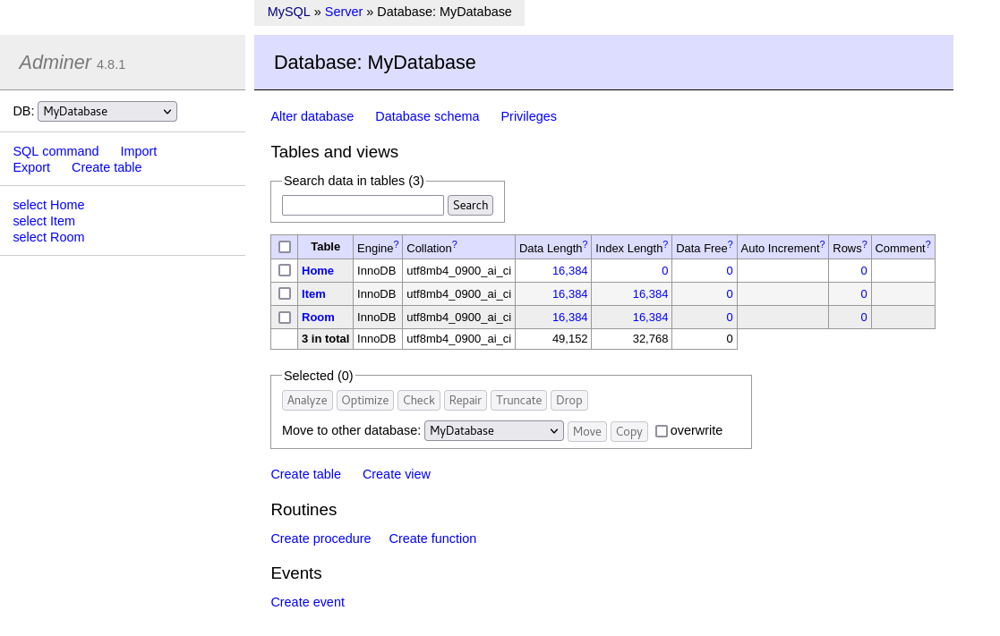

SQL servers are easiest to manage through the terminal, but when you are first getting started, sometimes a GUI can make things less intimidating. In your own SQL server, you can choose to skip the configuration of a GUI, but we'll set up the GUI in our lab.

We will use Adminer, but you can also use tools like phpMyAdmin and MySQL Workstation.

First, quit your MySQL session by running the following commmand:
```sql
quit;
```

To install Adminer, run the following command to install php and php MySQL extension. These are required to successfully run Adminer.
```bash
dnf install -y php php-mysqli
```

Next, run the following command to make a directory for Adminer and use it as your working directory:
```bash
mkdir /var/www/html/adminer && cd /var/www/html/adminer
```

To download Adminer into the directory you made, run this command:
```bash
wget -O index.php https://github.com/vrana/adminer/releases/download/v4.8.1/adminer-4.8.1-en.php
```

Next, configure Adminer's ownership and permissions:
```bash
chown -R apache:apache index.php /var/www/html/adminer/
chmod -R 775 /var/www/html/adminer/
```

To complete the installation, restart the web server through `systemctl restart`:
```bash
systemctl restart httpd
```

Now, go ahead and select the `Adminer` tab at the top of your Instruqt window.

Log in with the following settings:
* System: MySQL
* Server: localhost
* Username: root
* Password: rhel
* Database: MyDatabase

You will now see the three tables you created earlier:

