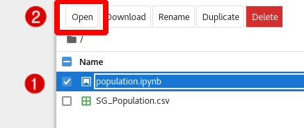
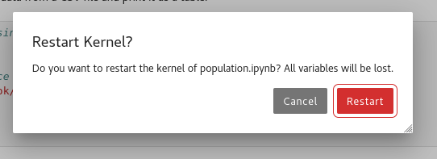
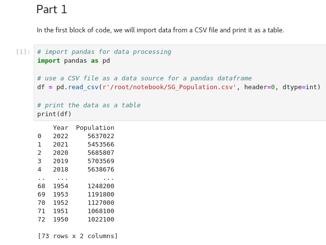

First, launch Jupyter Lab:
```bash,run
jupyter notebook --ip=* --no-browser --allow-root -NotebookApp.password='redhat' -NotebookApp.token='redhat' --notebook-dir="/root/notebook"
```
>Explanation of the command:
> * `jupyter notebook` specifies that you want to create a Jupyter Notebook
> * `-ip=*` allows the notebook to accept connections from any IP address
> * `--no-browser` stops the program from trying to open the browser on the system hosting the server
> * `--allow-root` allows you to run a Jupyter server as the root user
> * `-NotebookApp.password='redhat'` sets the password to `redhat`
> * `-NotebookApp.token='redhat'` sets the login token to `redhat`
> * `--notebook-dir="/root/notebook"` sets the folder for your Jupyter to a subdirectory of your root directory called `notebook`. This directory and the files inside it were created by this lab.

Click on the `Jupyter Notebook` tab near the top of the lab window. This will open your Jupyter Notebook in a new tab.

When presented with a login screen, enter `redhat` into the password box and click `Log in`.


When you reach the notebook's main menu, click on the check box to the left of `population.ipynb`, and then click open.


First, take a look at the Jupyter Notebook. You'll notice that is structured as code surrounded by formatted text, offering context as to what the code is doing. In its current state, there is no visible output from your code. To view the output of your code, you will need to run the program.

To run all of the code, click on the button pictured below:


Next, you will be prompted with a dialog box asking whether you wish to restart the kernel. Click `Restart`.

The kernel will restart and your program will run. This will take a few seconds to finish.

The output should look like this:
Part 1 output sample:


Part 2 output sample:


You have now successfully used a Jupyter Notebook in Red Hat Enterprise Linux! This concludes the lab instructions, but feel free to explore and modify the Jupyter Notebook in this virtual machine.