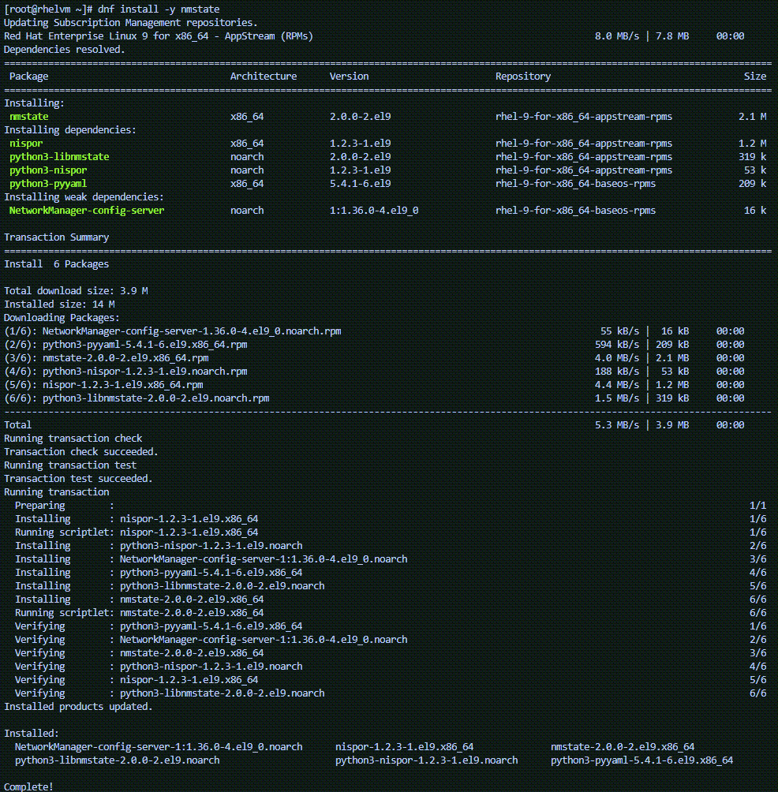

## What is nmstate?

NMState is a library with an accompanying command line tool that manages host networking settings. NMState is a convenient way to capture network settings into an easily readable yaml file.

To install NMState, run the following command in the CLI.

```bash
dnf install -y nmstate
```



We'll use NMState later on in this lab.
