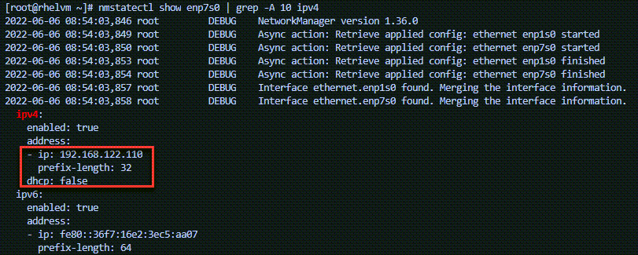
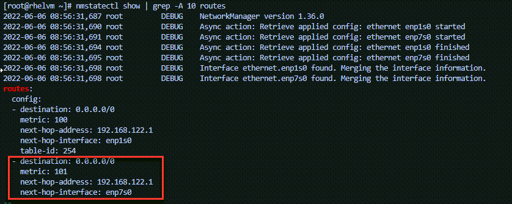

## Activating the connection

The changes we've made to the connection `ethernet1` have not been activated.

Run the `nmcli con up` command to activate the static connection that you configured in the previous step:

```bash
nmcli con up ethernet1
```

Run the following to check the ip address and dhcp settings are correctly configured.

```bash
nmstatectl show enp7s0 | grep -A 10 ipv4
```



You can see that the address is configured with `192.168.122.110/32` with `dhcp` set to `false`, as expected.

Enter the following to check the default gateway.

```bash
nmstatectl show | grep -A 10 routes
```



The final step is to learn how to configure the DNS server addresses
for the connection.
