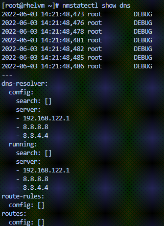

Configuring DNS
===

Now you will add DNS addresses using `nmcli con modify`.
Visit [this article](https://www.redhat.com/sysadmin/dns-domain-name-servers)
to learn what DNS is and why it is useful.

```bash,run
nmcli con modify ethernet1 ipv4.dns 172.17.0.254
```

This modification will only show up in the proper config file, `/etc/resolv.conf`, once the connection is restarted. This is done the same way the connection was activated at the start of this lab, using the `nmcli con up` command.

```bash,run
nmcli con up ethernet1
```

Now you can see these changes reflected in the connection's config file:

```bash,run
grep 'nameserver' /etc/resolv.conf
```

<pre class=file>
nameserver 192.168.122.1
nameserver 172.17.0.254
</pre>

It is common to want multiple DNS addresses associated with a connection. You can add multiple DNS addresses by enclosing the set of addresses in quotes:

```bash,run
nmcli con modify ethernet1 ipv4.dns "8.8.8.8 8.8.4.4"
```

As before, restart the connection.

```bash,run
nmcli con up ethernet1
```

Now the new DNS address shows up in `resolv.conf`:

```bash,run
grep 'nameserver' /etc/resolv.conf
```

<pre class=file>
nameserver 192.168.122.1
nameserver 8.8.8.8
nameserver 8.8.4.4
</pre>

<!-- NMState can also tell us that these DNS servers are active.

```bash,run
nmstatectl show dns
```

 -->

This is just the surface of what `nmcli` can modify. The [Red Hat Customer Portal](https://access.redhat.com/documentation/en-us/red_hat_enterprise_linux/7/html/networking_guide/sec-configuring_ip_networking_with_nmcli) has documentation on the full capabilities of NetworkManager.
