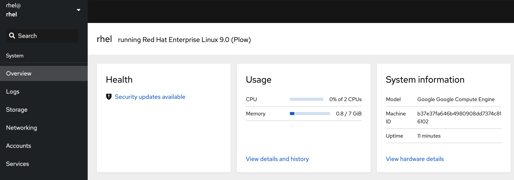

## Utilizing PCP with the Web Console

One of the easiest ways to observe the performance status of a RHEL server is via the Web Console, based on the upstream Cockpit project. As the web console is built to be modular, you will need to install the plugin for PCP:

```bash
dnf install -y cockpit-pcp
```

Then start the web console:

```bash
systemctl enabled --now cockpit.socket
```

In the second tab, you can now login to the web console.

User: rhel
Password: redhat



On the dashboard, you will see the CPU and Memory usage of your system update live. To dive in deeper, you can click on `View details and history`

The services, processes, and disks are hyperlinks that take you either to more detailed graphics, the appropriate web console screen, or even the system logs. This allows for a more unified troubleshooting experience.


In the final step, you will start several processes and utilize the PCP suite to observe its impact on system resources.
