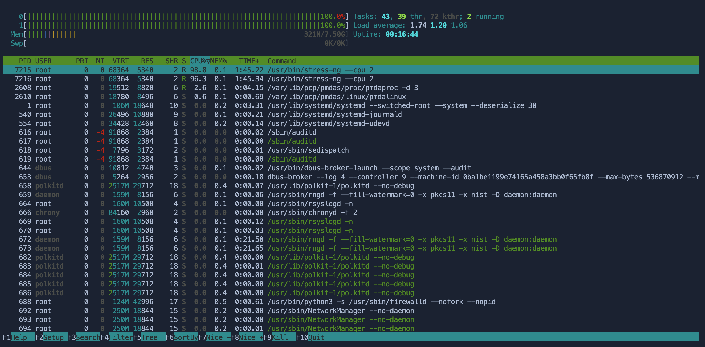
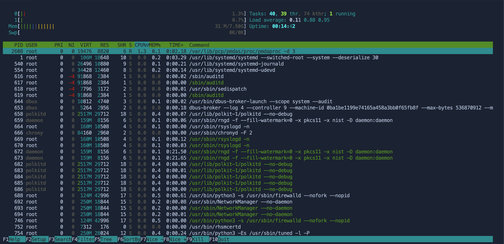

## Troubleshooting high CPU usage

Over the course of this lab, you have enabled the command line-based PCP tools. Now, you will put those pieces together to see what happens to a system while CPU constrained. In the background, the server has kicked off a proces that is putting a heavy strain on the CPUs.

Let's launch a process that will generate a heavy strain on the CPUs. In the `Terminal`, run the following:

```bash
nohup /usr/bin/stress-ng --cpu 2 > stress.out 2> stress.err < /dev/null & disown
```

One of the quickest ways to assertain the root of the problem is with a live view of performance in a top-like interface:

```bash
pcp htop
```



Note that both CPUs are reporting 100%. The table shows the heaviest proceses in terms of CPU. Once you note the PID (Process Identifier) of the busiest process, use CTRL+C to exit.

With this PID, you can investigate further or utiilize it in a kill command. In this case, you are able to also kill all running processes with the name of the runaway process:

```bash
killall stress-ng
```

<pre class="file>
# killall stress-ng
#
</pre>

Wait several seconds, then refer back to the htop output. You will notice that the CPU utilization has returned to an idle state:

```bash
pcp htop
```



This lab barely scratches the surface of what's available in the PCP command line tools. For more information please visit our documentation: [Monitoring and managing system status and performance](https://access.redhat.com/documentation/gu-in/red_hat_enterprise_linux/9/html/monitoring_and_managing_system_status_and_performance/setting-up-pcp_monitoring-and-managing-system-status-and-performance#doc-wrapper)

Finally, if you are interested in seeing these tools in a graphical format, please visit the companion lab:
[Using Web Console to Monitor Performance](https://lab.redhat.com/tracks/webconsole-perf)