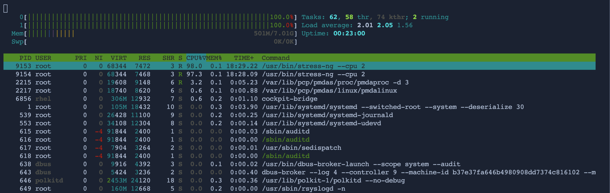
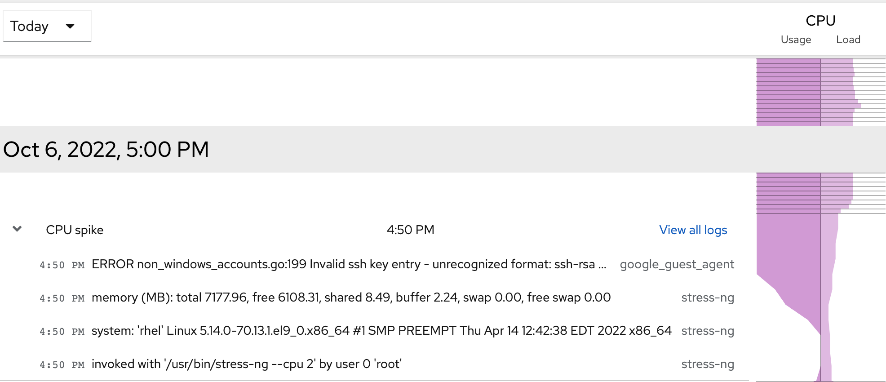

## Troubleshooting high CPU usage

Over the course of this lab, you have enabled the PCP tools for CLI and web UI utilization. Now, you will put those pieces together to see what happens to a system while CPU constrained.

In the background, the server has kicked off a proces that is putting a heavy strain on the CPUs. You will first use the CLI to identify this process then also with the web console.

One of the quickest ways to assertain the root of the problem is with a live view of performance in a top-like interface:

```bash
pcp htop
```

Note that both CPUs are reporting 100%. The table below will show the heaviest proceses in terms of CPU. Once you note the PID (Process Identifier) of the top process, use CTRL+C to exit.



With this PID, you can investigate further or utiilize it in a kill command. However, before you kill the runaway process, switch to the Web Console tab.

You will notice on the Performance Metrics screen that the live performance graphs have indicated a CPU spike. You are able to see when the spike began as well as click on the `>` to gain additional insights



This will output log entries and time stamps that help you walk back to what caused the spike to begin. Notice that the `stress-ng` process has been identified as the root cause.

This lab barely scratches the surface of what's available in the PCP command line tools. For more information please visit our documentation: [Monitoring and managing system status and performance](https://access.redhat.com/documentation/gu-in/red_hat_enterprise_linux/9/html/monitoring_and_managing_system_status_and_performance/setting-up-pcp_monitoring-and-managing-system-status-and-performance#doc-wrapper)