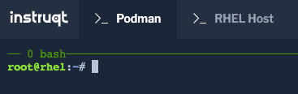

In this lab we have two terminals to make navigation easier. The `Podman` terminal will be used for podman related tasks. The `RHEL Host` tab will be used for host related tasks.



Click on the `Podman` tab.

Enter the following command to view the existing images on the RHEL host.

```bash
podman images
```

<pre class=file>
REPOSITORY              TAG      IMAGE ID       CREATED        SIZE
localhost/rhel9-httpd   latest   c12e3720df7b   43 hours ago   499 MB

</pre>

There is one container available in the local (localhost) repository,
__rhel9-httpd__.  If there were multiple updated iterations of the conatiner
available, you would use the __IMAGE ID__ to work with those that are not
tagged as __latest__.  Also, from this list you are able to see the size, on
disk, of the container image.
