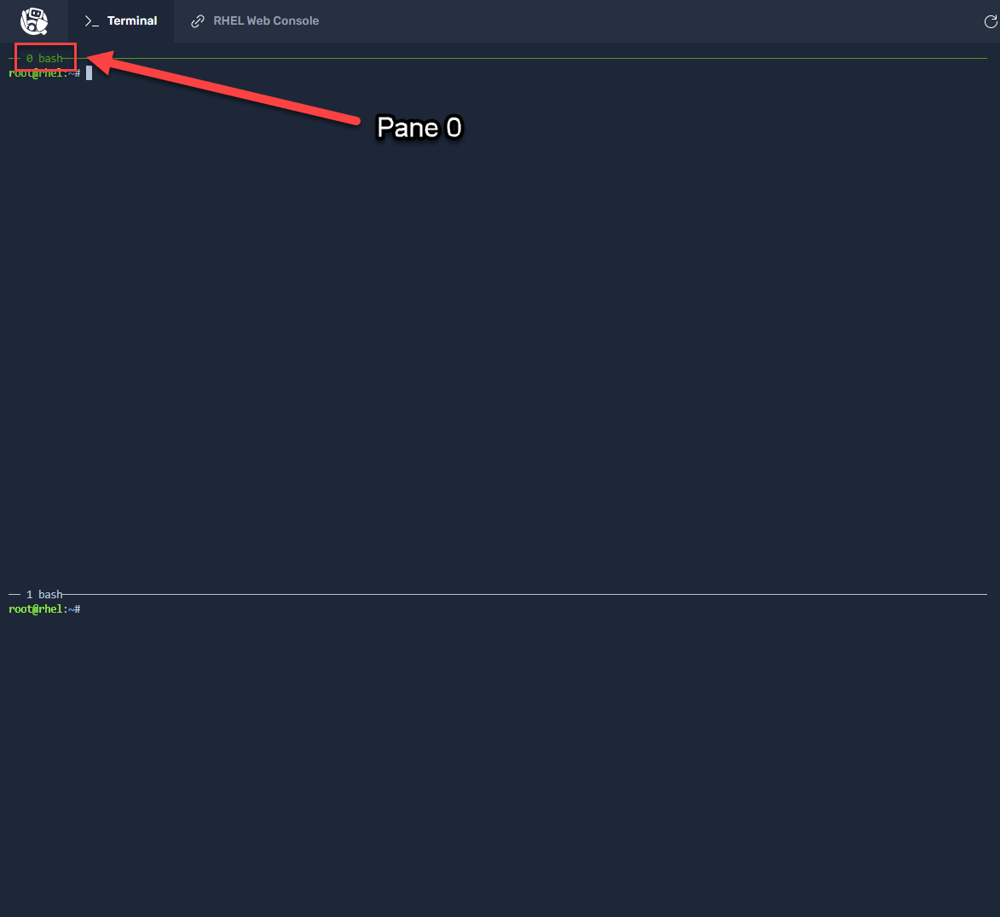

>**Note:** In the `Terminal` tab in the upper left corner of the Instruqt web page, there are 2 shell sessions launched. To switch between the 2 shell sessions, press Ctrl-B and an arrow key pointing to the session you wish to become active.

First, go to pane 0.



Using the top terminal session, view the container images available.

```bash
podman images
```

<pre class=file>
REPOSITORY              TAG      IMAGE ID       CREATED        SIZE
localhost/rhel9-httpd   latest   c12e3720df7b   43 hours ago   499 MB

</pre>

There is one container available in the local (localhost) repository,
__rhel9-httpd__.  If there were multiple updated iterations of the conatiner
available, you would use the __IMAGE ID__ to work with those that are not
tagged as __latest__.  Also, from this list you are able to see the size, on
disk, of the container image.
