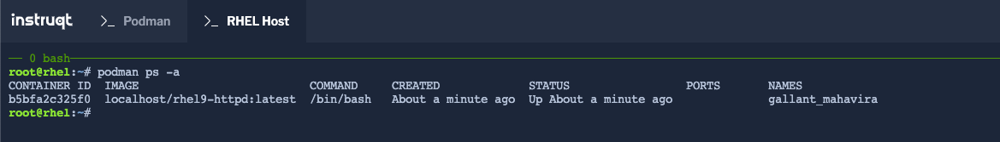

The __rhel9-httpd__ container includes a bash shell.  In this step, you will
deploy the container in an interactive fashion, which will allow you to run commands within the deployed container. In the `Podman` tab run the following:

```bash
podman run -it rhel9-httpd /bin/bash
```

You should now be looking at a generic bash shell prompt:
<pre class="file">
bash-5.1#
</pre>

In the `Podman` tab, the displayed shell is running inside the container image, not the host operating system.  To confirm this, take a look at the mounted filesystems:

```bash
df -hP
```

<pre class="file">
Filesystem      Size  Used Avail Use% Mounted on
overlay          35G  6.1G   30G  36% /
tmpfs            64M     0   64M   0% /dev
tmpfs           909M  9.8M  900M   2% /etc/hosts
shm              63M     0   63M   0% /dev/shm
tmpfs           909M     0  909M   0% /sys/fs/cgroup
tmpfs           909M     0  909M   0% /proc/acpi
tmpfs           909M     0  909M   0% /proc/scsi
tmpfs           909M     0  909M   0% /sys/firmware
tmpfs           909M     0  909M   0% /sys/fs/selinux
tmpfs           909M     0  909M   0% /sys/dev
</pre>

You will notice that all of the filesystem contents are either memory-based (tmpfs, shm) or the overlay file associated with this runtime of the container image (overlay).

Switch to the `RHEL Host` tab. Use this terminal to verify that the container is running:

```bash
podman ps -a
```

<a href="#example_image">
 
</a>

<a href="#" class="lightbox" id="example_image">
 
</a>

__Note:__ Your CONTAINER ID and NAMES will be different than the output displayed above as each container is assigned a unique ID and Name.

<style>
.lightbox {
  display: none;
  position: fixed;
  justify-content: center;
  align-items: center;
  z-index: 999;
  top: 0;
  left: 0;
  right: 0;
  bottom: 0;
  padding: 1rem;
  background: rgba(0, 0, 0, 0.8);
}

.lightbox:target {
  display: flex;
}

.lightbox img {
  max-height: 100%;
}
</style>
