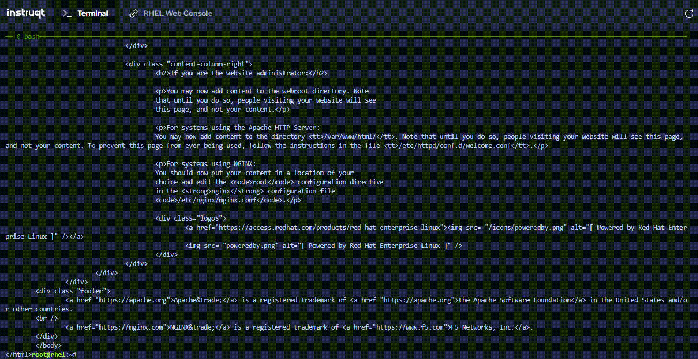

Running an interactive container is all well and good, however, if the container is offering applications or services, you do not need to interact with it.

The __rhel9-httpd__ container, for example, is configured with an Apache web server running within it.  You will create a new instance of this container in a detached mode.  Further, the command provided will configure port forwarding for the Apache web server so that connections to the host's port 8081 will redirect to the running container's port 80 (Apache service).

```bash
podman run -dt -p 8081:80/tcp rhel9-httpd
```

You can verify the state of the container using __podman ps__

```bash
podman ps -a
```

<pre class="file">
CONTAINER ID  IMAGE                         COMMAND               CREATED         STATUS             PORTS                   NAMES
2b2571efec6f  localhost/rhel9-httpd:latest  /usr/sbin/httpd -...  13 seconds ago  Up 12 seconds ago  8081->80/tcp  priceless_mahavira
</pre>

Observe that the __STATUS__ is __Up__ and there is a new section in the output __PORTS__ that indicates the port forwarding defined for the container.

Test the webserver on the container with `curl`.

```bash
curl localhost:8081
```

This should now display the Apache test page, being served by the httpd daemon running in the container.

