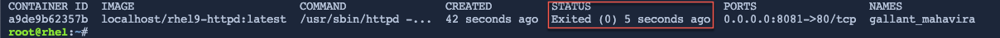

Unlike interactive containers, detached containers are stopped using __podman stop <CONTAINER ID>__.

```bash,run
podman stop $(podman ps -a | grep Up | cut -d" " -f1)
```

In the command above, we use a bit of bash scripting to determine the __CONTAINER ID__ as it is going to be a value unique to each container image.

You can verify that the container is now exited:

```bash,run
podman ps -a
```

<pre class="file">
CONTAINER ID  IMAGE                         COMMAND               CREATED        STATUS                     PORTS                   NAMES
2b2571efec6f  localhost/rhel9-httpd:latest  /usr/sbin/httpd -...  9 minutes ago  Exited (0) 50 seconds ago  0.0.0.0:8081->80/tcp  priceless_mahavira
</pre>
<a href="#example_image">
 
</a>