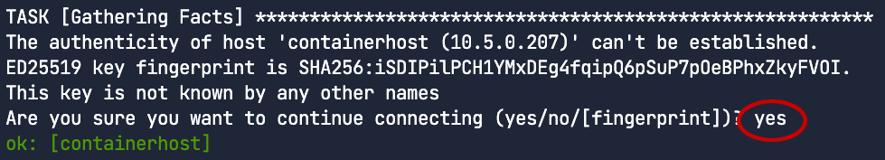

# RHEL System Roles
If you haven't used RHEL system roles in the past, you've been missing out!  System Roles are a collection of Ansible roles that will help you perform server administration tasks using automation.

This collection of roles is included in RHEL, and use ansible-core to execute, but can also be leveraged using Ansible Automation Platform.

In this step, we're going to use the Podman system role, to deploy our pod to a second host.

# Setup
We have created all of the files that you'll need to make the automation run, but let's have a look at what we're doing.  Within the `my-app` sub-directory you will find two new files, `my-app-deploy.yaml` and `inventory`.  These two files are all we'll need to take our existing definitions and get them up and running on our `containerhost`.

First, on our `RHEL` host, have a look at the `inventory` file.

```bash,run
cd ~/my-app
cat inventory
```

You will see a very basic inventory, containing a host group called `ContainerHosts` and a single host, `containerhost`

<pre>
# cat inventory
[ContainerHosts]
containerhost
</pre>

Now we will look at the real magic, the deployment playbook.

```bash,run
cat my-app-deploy.yaml
```

<pre type=file>
# cat my-app-deploy.yaml
---
- name: Run the podman system role
  hosts: ContainerHosts
  become: yes
  vars:
    podman_run_as_user: root
    podman_run_as_group: root
    podman_firewall:
      - port: 8080/tcp
        state: enabled
    podman_quadlet_specs:
      - file_src: my-app-configmap.yaml
      - file_src: my-app.yaml
      - file_src: quadlet/my-app.kube
        state: started
  roles:
    - rhel-system-roles.podman
  </pre>

A few things to note:
`hosts: ContainerHosts` tells the playbook to run on any host in the ContainerHosts host group

<pre type=file>
    podman_firewall:
      - port: 8080/tcp
        state: enabled
</pre>
The above block tells the role that port 8080 will be used to listen for requests for our pod. This will make sure that the `containerhost` will open this port in its host-based firewall.

<pre type=file>
    podman_quadlet_specs:
      - file_src: my-app-configmap.yaml
      - file_src: my-app.yaml
      - file_src: quadlet/my-app.kube
        state: started
</pre>
The above block tells the system role to deploy the files required to deploy our pod under systemd via quadlet.  It is important that files are deployed in the order in which they are needed.  For instance, the quadlet, `my-app.kube`, requires both `my-app-configmap.yaml` and `my-app.yaml`, so they must be defined first.

# Execute the playbook

Now why don't we run the playbook, and deploy our pod.  Remember that this is going to deploy to our second host, which has nothing deployed on it currently.  Ansible is going to take that system from nothing, to running our application in no time.

Run the following command
```bash,run
ansible-playbook -i ./inventory ./my-app-deploy.yaml
```

> _NOTE_: The execution of ansible-playbook will first attempt to connect to `containerhost`.  This will generate a question from ssh, asking whether you accept `containerhost`'s ssh key.  You will need to tell it `yes`


You should see many lines of Ansible output as the playbook performs different tasks on `containerhost`, and once it is complete you will be returned to a bash prompt.  This may take some time as podman pulls down those container images.

If everything succeeded, we should see a play recap that does not indicate any errors (OK, skipped, and changed are all good outputs here) and now find our application running on `containerhost`.

# Testing for success

First, if we simply try to connect to the web page on `containerhost` from `rhel` we should get the RHEL test page.

```bash,run
curl http://containerhost:8080
```

Now, let's switch to the ContainerHost tab, and look at podman.

After switching to the [button label="ContainerHost" background="#ee0000" color="#c7c7c7"](tab-1) tab, check the status in systemd of the my-app service.

```bash,run
systemctl --no-pager status my-app
```

You should see it up and running, we can also check podman.

```bash,run
podman pod ps
```

# Making changes with Ansible.
We can also make changes within ansible.  Let's say that we made a mistake and meant to forward port 80 to port 8080 on our container.  There are three places which we would have to set that.  The quadlet definition, the Kube yaml, and of course the deployment playbook.  Let's switch to [button label="File Browser" background="#ee0000" color="#c7c7c7"](tab-2) and make those changes.

First, open up `my-app.yaml` and change line 15 from `hostPort: 8080` to `hostPort: 80`. The changes will save automatically.

Then head over to `quadlet/my-app.kube` and change line 8 from `PublishPort=8080:8080/tcp` to `PublishPort=80:8080/tcp`. Again, the changes will save automatically.

Finally, we'll need to change the port that our ansible playbook opens, in the `my-app-deploy.yaml` file chage line 9 from `- port: 8080/tcp` to `- port: 80/tcp`.

Now head back to the [button label="RHEL" background="#ee0000" color="#c7c7c7"](tab-0) tab, and double-check that the changes are correct.

```bash,run
cd ~/my-app
cat my-app.yaml
cat quadlet/my-app.kube
cat my-app-deploy.yaml
```
Remember, the `hostPort` in the `my-app.yaml` should now be `80`, and the `PublishPort` in the `my-app.kube` should now be `80:8080/tcp`, lastly the `port` in `my-app-deploy.yaml` should be `80/tcp`.

Now let's run the playbook again to apply our changes.  Ansible will push the latest versions of our files to the managed host, and re-deploy our containers.

```bash,run
ansible-playbook -i inventory my-app-deploy.yaml
```

Once the playbook finishes, our application should be listening on port 80, we can test that with:
```bash,run
curl http://containerhost:80
```

# Conclusion
In this lab we've taken a basic pod deployment in Podman, and turned it into something that can be easily re-deployed time and time again with automation.  We hope you can see how these techniques might help you in your day to day tasks.

Thank you!