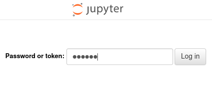
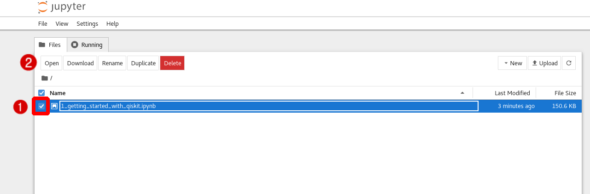

To launch your Jupyter Notebook, run the following command:
```bash
jupyter notebook --ip=* --no-browser --allow-root -NotebookApp.password='redhat' -NotebookApp.token='redhat' --notebook-dir="/root/quantum"
```
>Explanation of the command:
> * `jupyter notebook` specifies that you want to create a Jupyter Notebook
> * `-ip=*` allows the notebook to accept connections from any IP address
> * --no-browser stops the program from trying to open the browser on the system hosting the server
> * `-NotebookApp.password='redhat'` sets the password to `redhat`
> * `-NotebookApp.token='redhat'` sets the login token to `redhat`
> * `--notebook-dir="/root/quantum"` sets the folder for your Jupyter to a subdirectory of your root directory called `quantum`. This directory was created by this lab.

Next, click on the `Jupyter Notebook` tab near the top of the lab window. This will open your Jupyter Notebook in a new tab.

When presented with a login screen, enter `redhat` into the password box and click `Log in`.


When you reach the notebook's main menu, click on the check box to the left of `1_getting_started_with_qiskit.ipynb` and then click `open`.
