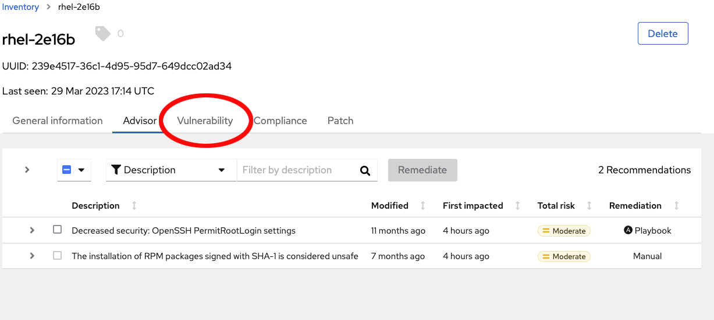
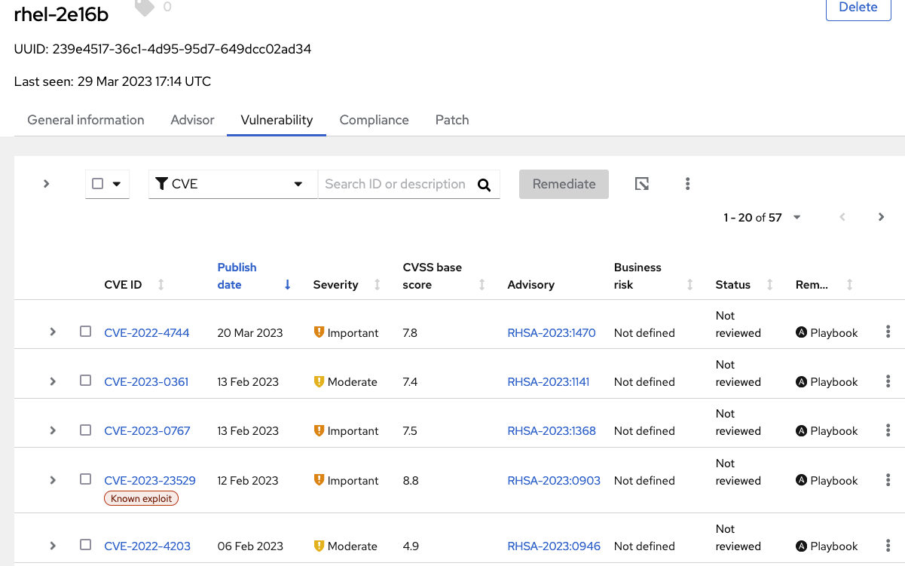
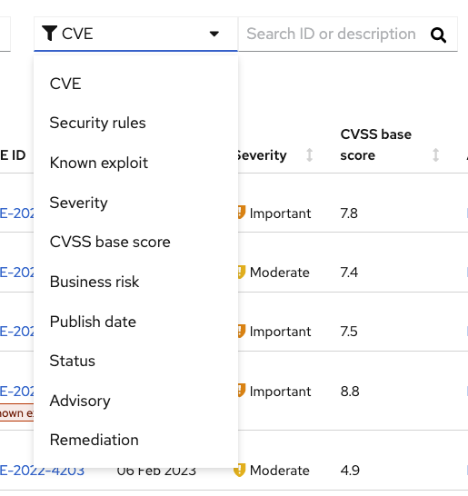
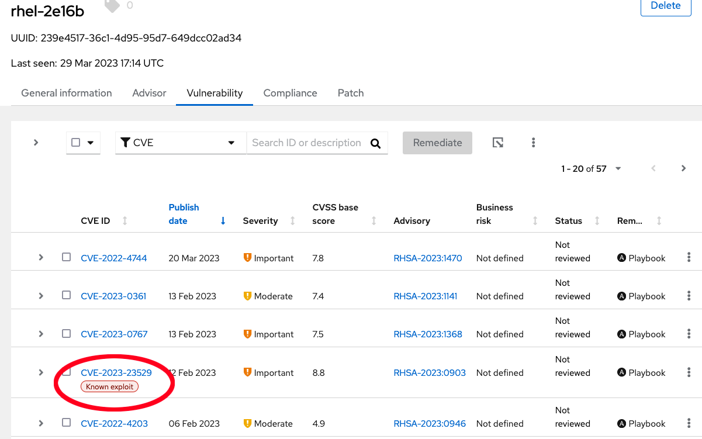

Now that we've had a look at Advisor, let's see what's in the Vulnerability tab.

Here we can see all of the vulnerabilities that Insights knows about, that our system is not patched to resolve.

Note that insights allows you to filter based on severity, or even whether there is a known exploit available for a given CVE.

Known exploits also show up with a tag in the vulnerabilities list.

You can click on the CVE ID to see a list of hosts that Insights has also identified as affected by this vulnerability, or the RHSA to go to the Red Hat Security Advisory related to this vulnerability.

