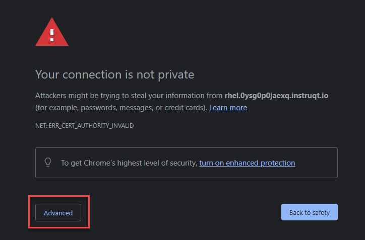
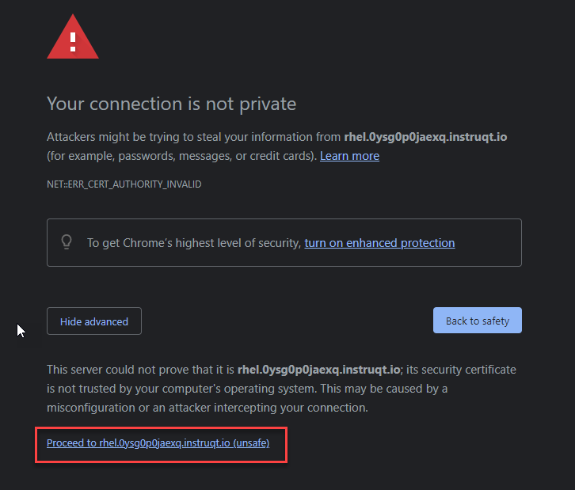
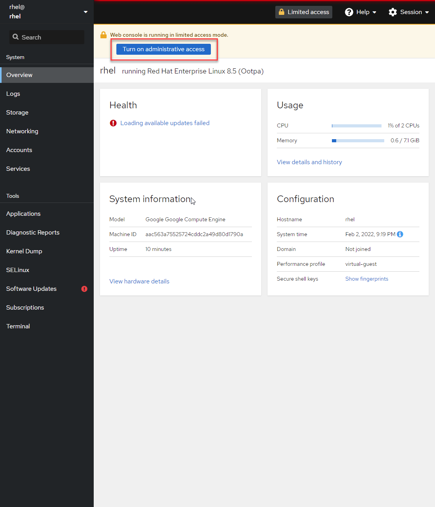
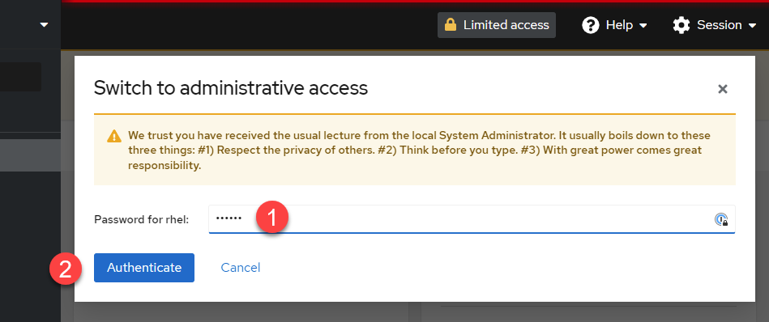

In this lab, we will introduce the usage of RHEL for Edge. Before starting the lab, we'll get oriented with the environment.

>_NOTE:_ To make the inline images larger, expand this window. 

First, log into the web console for the RHEL host.

Click on the tab titled **RHEL Web Console** at the top of  your lab system interface. Selecting this tab will open the lab system's Web Console in a
new browser tab or window.

Click `Advanced`

Then click `Proceed to rhel.xxxx.instruqt.io`

Once the login page is presented, use the following credentials to log into the Web Console:

Username: **rhel**\
Password: **redhat**

## Turn on administrative access

Click `Turn on administrative access`.

Next do the following:

1) Enter the password: **redhat**
2) Click `Authenticate`

