Let's build an image to provision our edge device.

We need to create a blueprint. A blueprint contains metadata specifying the software components that will be added to an image.

1) Click on `Image Builder`.
2) Click on `Create blueprint`.

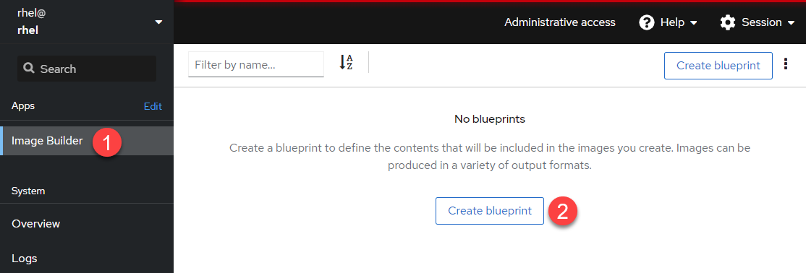

1) Name your blueprint. We'll call this `edge_device_blueprint`.
2) Click `Create`.

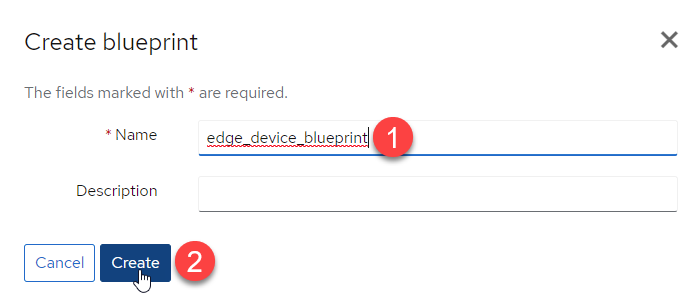

Now we'll add the software component `vim-enhanced` to the blueprint.

1) Enter `vim` in the search box.
2) Add `vim-enhanced`.
3) Click `Commit`.

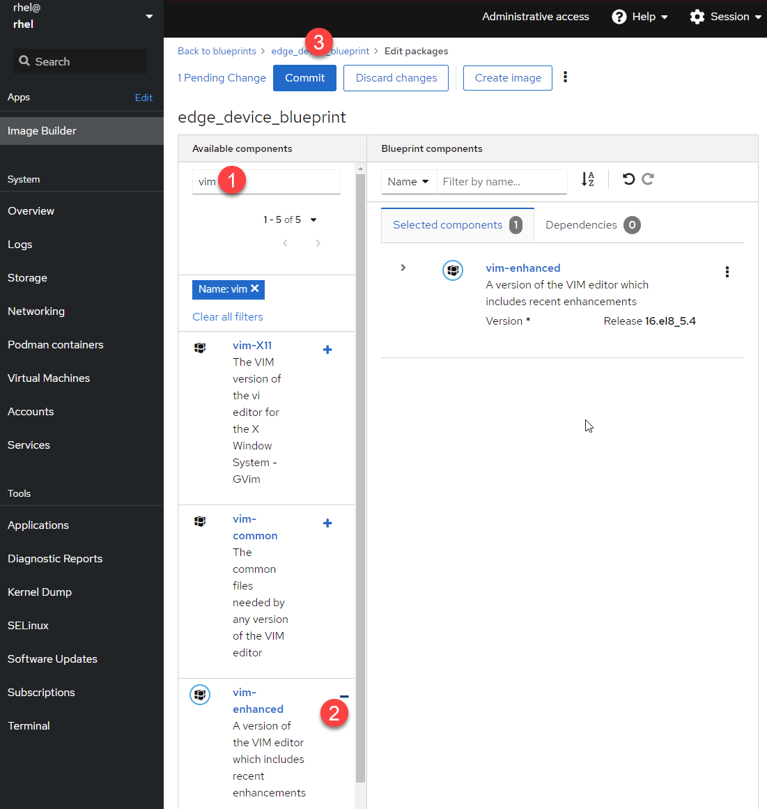

Click `Commit`.

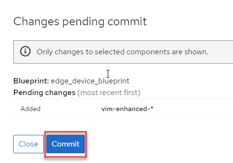

Let's add a user account to this blueprint so we can log into the edge device after it's been provisioned.

Click on `Image Builder`.

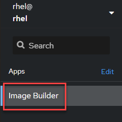

Click on `edge_device_blueprint`.
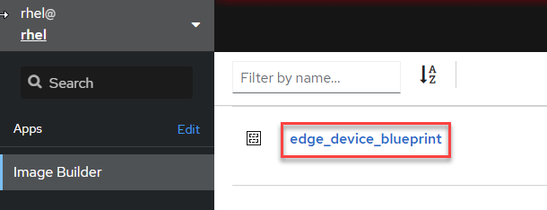

Click on `Create user account`.

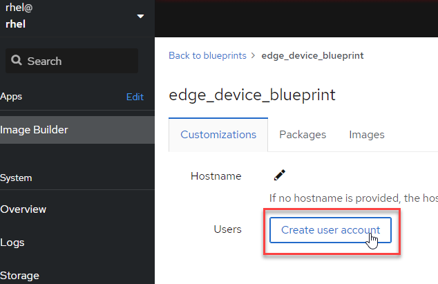

Create a user account.

1) Enter the user name `rhel`.
2) Click `Server Administrator`.
3) Paste this public key into the `SSH key` field. Public SSH key

```bash
ssh-rsa AAAAB3NzaC1yc2EAAAADAQABAAACAQDSUU49yfbjLN2LDmomWe5qLdQoneD3poYUVpgVo/5B6Y4nG+fNwFjf7uS8F/cEeYl1ECHJvH+5mfk6bd1VPWNYt0sqAas7qXtd6qRLC0jjyMxmR/C8AhslwTux94wr3mjjNPdPm2cEltWtdMkhPhKCk2XAi+O8e26HWhfWlz/C7Ph74MYFM0zlT2mvp/1hQA6V1ROmvKsqqBvVT6YkdeksBrJdStq9jA3eGYwO1vyR/s2O5votKghm14N54Ki1VuV1yRXAuuXPLIFZcBGKwFofYw9boJCExrTd64WaJ+2v5hrJgNvPaX1aCr6y33c1Z9BqXW3tIWv+dhn2CyWheIVYaIMdm2a9UJ/Yw7QNZysg670YXDF7L/mVC7CSdAovHDdO30xcyc74lJTUvFtSwpxZy+LktnttVVY2JuMZf85x5ld978DWgmee2j7qdedKYrLzF5ieIKFTjCpw0QoNEeT/DmLladK+KAcei1pSPlEbVaRF0PQAusM0pPnQJMfjK1pM0DF0PWv5KEqYdY30yPuuxSHHfQIhbETYVjqVLD1LYRyhjLnw7oNMghYy9q0nbfp9YdqQYvI7aZ//I73LfdqYOzIbI+zDdmka12HQ825r4eeh8092czYEdeRV51I589oesrjorm2E5iUv/IwO9w5zmyRagRVMqBL2d205JWDS4w==
```

4) Click `Create`.

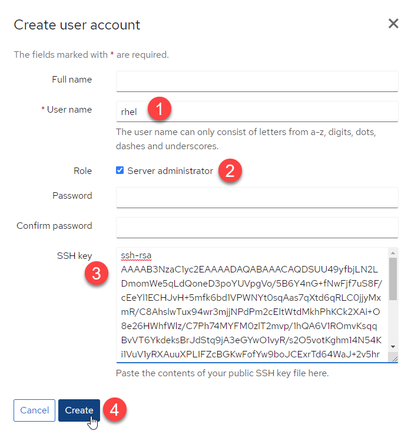

Click `Create image`.

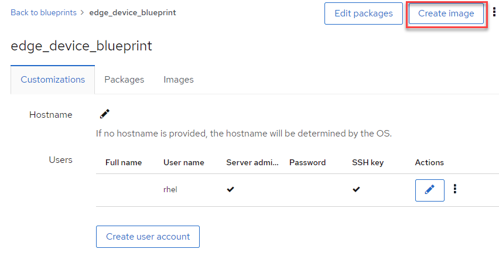

Now we'll create and image. In this lab, we will create an image that is a container we can run with podman. This container runs an nginx webserver that will provision the rpm-ostree components required to provisiong an edge device.

1) Choose `RHEL for Edge Container` in the dropdown.
2) Click `Create`.

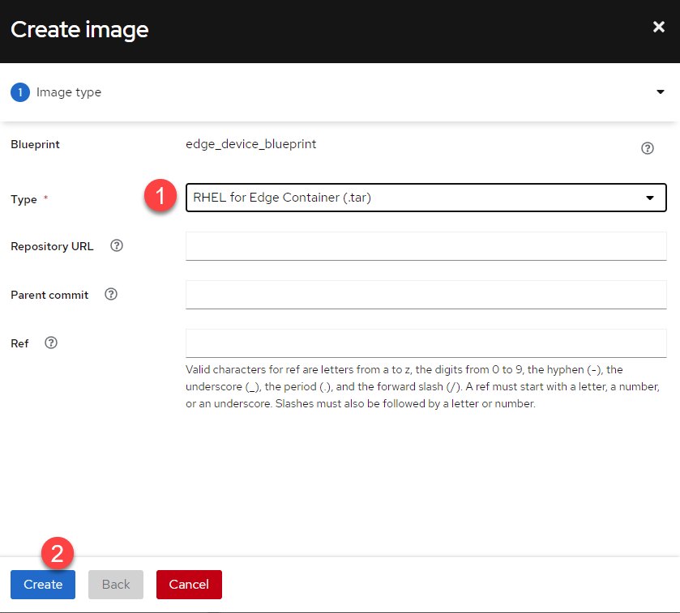

A message will pop up telling you that the image creation request has been queued.

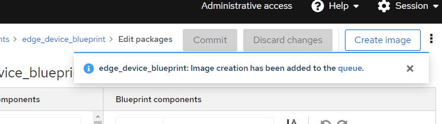

It will take about 15 minutes to build the image.
