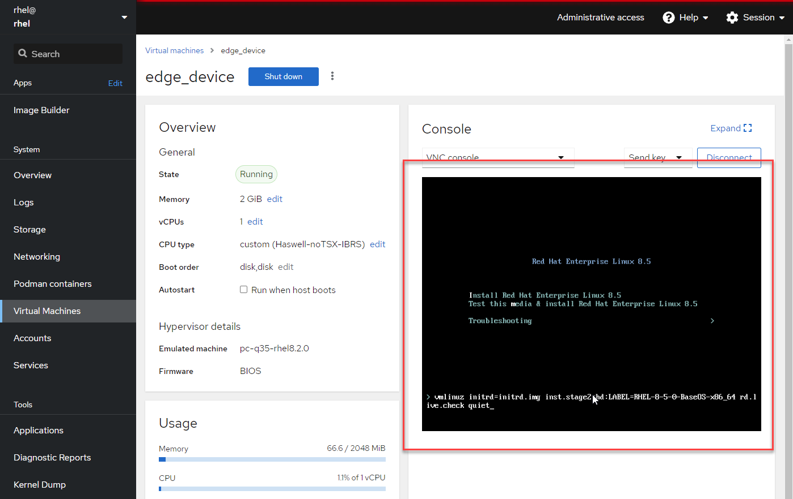

Now we'll serve the image to provision our edge device.

Check that the image has been created by clicking the `Images` tab.


When the image build is complete, a message will pop up and the status will show `Image build complete`.


Switch over to the terminal CLI.


We need to obtain the GUID of the image we just built. Enter the following on the cli.

```bash
composer-cli compose list
```


Download the image.

```bash
composer-cli compose image <guid>
```


To enable serving of this image by podman, we have to upload it to a local repo with skopeo.

The command looks like this.

```bash
skopeo copy oci-archive:<GUID>-container.tar containers-storage:localhost/<container name of your choice>:latest
```


We'll create a kickstart file. The edge device requires this to install the rpm-ostree image served by the container we created in the Build Image portion of this lab. You can generate your own kickstart with the [Red Hat Kickstart Generator](https://access.redhat.com/labsinfo/kickstartconfig).

Copy and paste the following kickstart file to the CLI.

```bash
tee -a /root/edge.ks << EOF
lang en_US
keyboard us
timezone America/Vancouver --isUtc
rootpw --lock
#platform x86_64
reboot
text
ostreesetup --osname=rhel --url=http://rhel:8000/repo --ref=rhel/8/x86_64/edge --nogpg
bootloader --append="rhgb quiet crashkernel=auto"
zerombr
clearpart --all --initlabel
autopart
firstboot --disable
EOF
```

Notice the line `ostreesetup --osname=rhel --url=<http://rhel:8000/repo> --ref=rhel/8/x86_64/`. As previously mentioned, the container will serve the rpm-ostree components required to install the OS on the edge device. We'll have to launch the podman container mapping port 8000 to the port that the webserver inside the container is listening on. This will be port 8080.

Start the podman container with the following command.

```bash
podman run -d --rm -p 8000:8080 -v /root/edge.ks:/usr/share/nginx/html/edge.ks:z <name of the edge container>
```

Here's what the flags in this command mean:

- `-d` - Run the podman container as a daemon.
- `--rm` - Delete the container instance after it's been stopped.
- `-p 8000:8080` - Forward requests to port 8000 on the host `rhel` to port 8080 in the container.
- `-v /root/edge.ks:/usr/share/nginx/html/edge.ks:z` - Share the file at `/root/edge.ks` to the file inside the container `/usr/share/nginx/html/edge.ks`. The `z` flag specifies that the `/root/edge.ks` file can be shared by multiple podman instances.


To test that this container is successfully working, download the edge.ks file with curl.

```bash
curl -X GET http://rhel:8000/edge.ks
```


Let's go back to the RHEL Web Console.

1) Click on `Virtual Machines`.
2) Click on `Create VM`.


Create a new VM with the following options.

1) Name the VM.
2) Select `Local install media`.
3) We'll require a RHEL 8.6 Boot ISO. This has already been obtained and is stored in the `/images` directory.
4) Click `Create`.


Quickly, click on the `edge_device` VM.


Click onto the VNC console and immediate type the `tab` button.



Enter the following boot parameter.

```bash
inst.ks=http://rhel:8000/edge.ks
```

Then press the `enter` button.


This boot parameter tells the boot iso to install rhel with the parameters entered in the edge.ks kickstart file we created earlier.

When the installation completes, the edge device (vm) will automatically reboot.

Now we'll log into the newly created edge device.

Get the ip address of your edge device with the following commands.

1) Get the list of VMs with `virsh list`
2) Get the ip address of the vm with `virsh domifaddr <edge device name>`.


SSH into the new edge device. A private key is provided.

```bash
ssh -i /root/r4ekey rhel@<edge device IP address>
```


You can check that the running edge device is running on the first commit of the OS image with the command `rpm-ostree status`.


