If you need to add or remove software from the edge device, you will need to update the blueprint and build a new container, serve the new container, and pull the changes to the edge device. Typically, the edge device can pull the changes on an automated schedule but for the purposes of this lab, we will manually pull the changes.

Go into the terminal and enter `rpm-ostree status` again.

Go back into the web console.

1) Click on `Image Builder`.
2) Click on `edge_device_blueprint`.
3) Click on `Edit packages`.

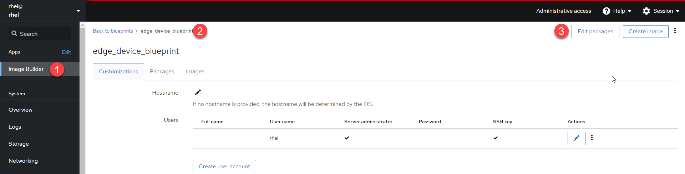

We'll add `tmux` to this image.

1) Enter `tmux` into the search field.
2) Add `tmux` to the image.
3) Click on `Commit`.

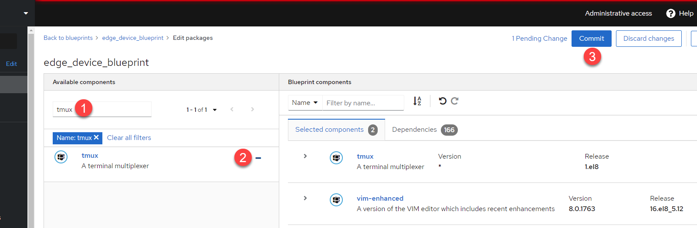

Click on `Commit` again.

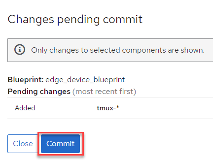

Click `Create image`.

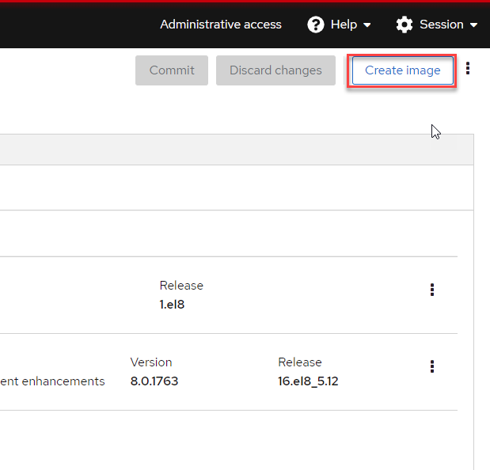

We'll need to create another container with the second commit.

1) Select `RHEL for Edge Container`.
2) Enter the url for the currently running instance of the RHEL for Edge Container. This is `http://rhel:8000/repo`. This parameter enables image builder to create an image which contains differences with the original commit, so that the update to the edge device only requires sending updates rather than a full image, saving bandwidth and storage.
3) Click `Create`.

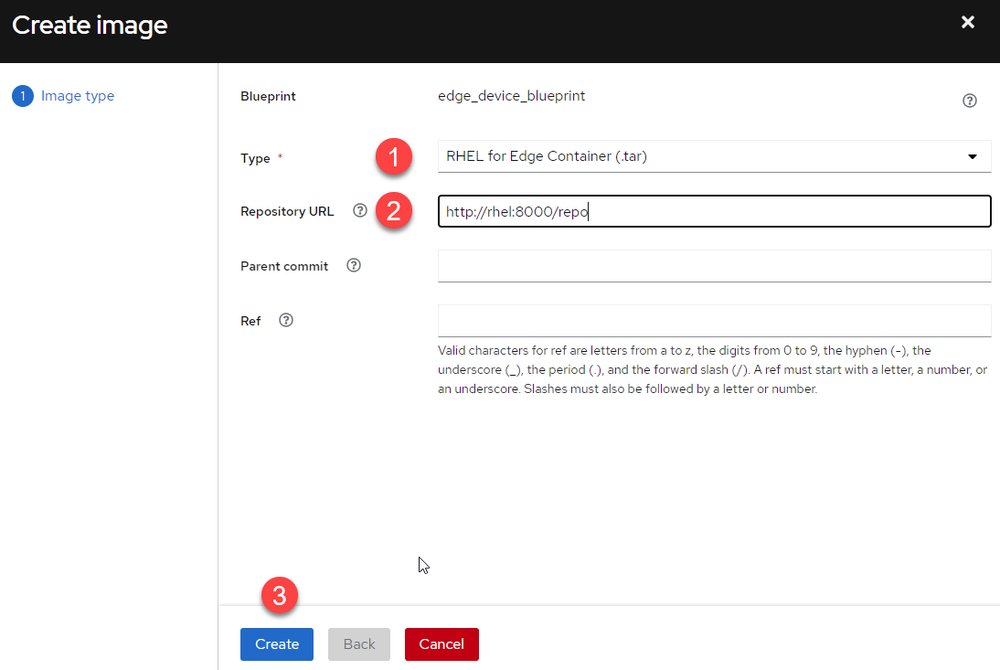

Stop and delete the previous running container.

```bash
podman ps
```

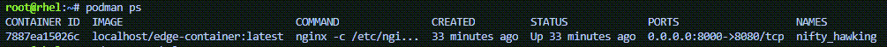

```bash
podman rm -l -f
```

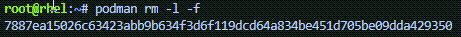

Now we'll download the new container image and serve it with podman again.

First list the images.

```bash
composer-cli compose list
```

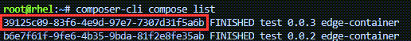

In this example the guid of the new image is `39125c09-83f6-4e9d-97e7-7307d31f5a6b`.

Download the image.

```bash
composer-cli compose image <GUID>
```


We'll upload the latest image to the local container registry with skopeo again.

```bash
skopeo copy oci-archive:<GUID>-container.tar containers-storage:localhost/<container name of your choice>:latest
```

skopeo copy oci-archive:39125c09-83f6-4e9d-97e7-7307d31f5a6b-container.tar container-storage:localhost/edge-container

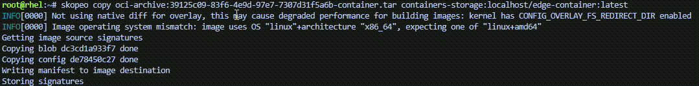

Now serve the podman container again.

```bash
podman run -d --rm -p 8000:8080 -v /root/edge.ks:/usr/share/nginx/html/edge.ks:z edge-container
```

Log into the edge device via ssh.

```bash
> virsh list
 Id   Name          State
-----------------------------
 3    edge_device   running

> virsh domifaddr edge_device
 Name       MAC address          Protocol     Address
-------------------------------------------------------------------------------
 vnet2      52:54:00:56:fb:66    ipv4         192.168.122.140/24

> ssh -i /root/r4ekey rhel@192.168.122.140
```

Check for the rpm-ostree update.

```bash
rpm-ostree upgrade check
```

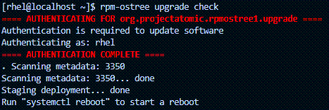

The `rpm-ostree upgrade check` command automatically detected, downloaded, and installed the new update.

```bash
rpm-ostree status
```

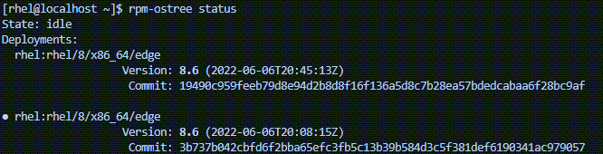

Reboot the edge device to run the upgraded OS.

```bash
systemctl reboot
```

SSH back into the edge device.

```bash
ssh -i r4ekey rhel@192.168.122.140
```

And check the running version of OS again.

```bash
rpm-ostree status
```

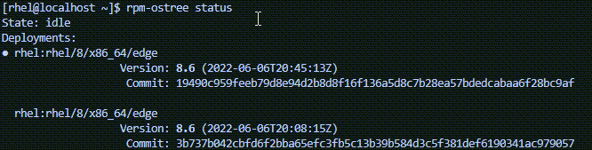

You can see that we are now running on the latest updated rpm-ostree image.
