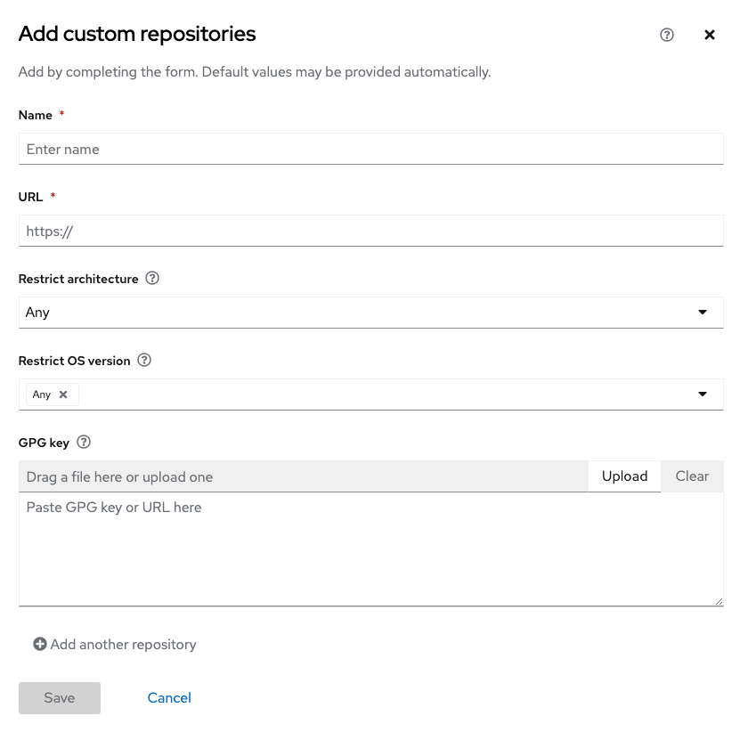

<!-- markdownlint-disable MD033 MD026-->

In this challenge we'll show you how to configure custom repositories. Custom repositories may be used to inject third party or custom RPMs into images built with the Image builder application. This challenge is optional as we will provide pre-configured custom repositories to be used later in this lab.

Let's navigate to the repositories menu.

Click on the `Settings gear` and click on `Settings`.

Click on `Repositories`

There are a few pre-configured repos.

_**At this point, you may add a custom repository or proceed to the next step.**_

If you would like to configure a custom repo, click on `Add repositories` and fill in the wizard below.

