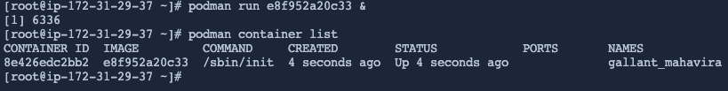

<!-- markdownlint-disable MD033 MD026-->

In the `Image Builder` menu, find the `summit-test` image. Click on `Launch`.


The next menu will prefill several values to customize the VM instance. We'll need to choose the instance type `t2.medium` and click `Next`.


Select the SSH public key `rhte_public_key` and click `Next`.


Review the details before clicking `Launch`.


When your instance has launched successfully, copy down the ID, DNS, and SSH command. In particular, save the SSH command.


**Do not close this window.**

You can save the SSH command in the built in `Notepad`.

Then click on the `Notepad` tab.


Click on `/notes/notepad`.


Paste the SSH command into the notepad and save it by clicking on the disk icon.


Return to the Launch window.


Clicking on the ID hyperlink will take you directly to the AWS console instance information page.

AWS credentials will be provided in-session.


Note that the instance was assigned a **private** DNS name.


In the `Red Hat Hybrid Cloud Console`, navigate to `Inventory`.


Notice that the AWS instance appears in the inventory. Recall that we configured the image to automatically register itself with Red Hat with the activation key `rhte`. When we launched the VM instance in AWS, it was automatically registered with this key.

_**NOTE:**_ If you do not see your host immediately, wait a few minutes and refresh your browser. It takes AWS a few minutes to provision the VM and then a few more minutes for the host to contact Insights.

Let's log into the instance via SSH.

Click on the `Terminal` tab.


In the terminal, SSH into the newly provisioned AWS instance. You can copy the SSH command from the `Notepad`. It might take a little while to connect so please be patient.


Let's check the software we added during the image build process is in good working order.

Switch to the root user.

```bash
sudo -i
```

Let's verify that we installed the `ubi-init` custom package successfully from our custom repository `CustomRepo`. Run the following command to check that a base image was added.

```bash
podman image list
```


Run the image in podman.

```bash
podman run e8f952a20c33 &
```

Check that the container is running.

```bash
podman container list
```



We've now demonstrated that we can build an image with the tools needed for developers to create containerized workloads, using custom software repositories. This workflow can be extended for other applications including workloads such as MS SQL or SAP.
