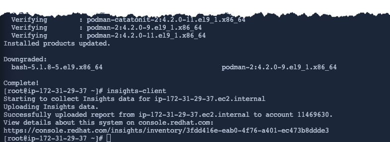
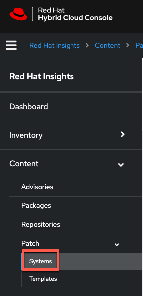
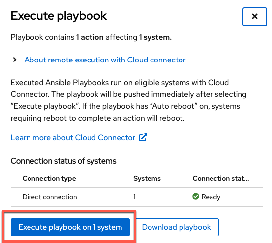
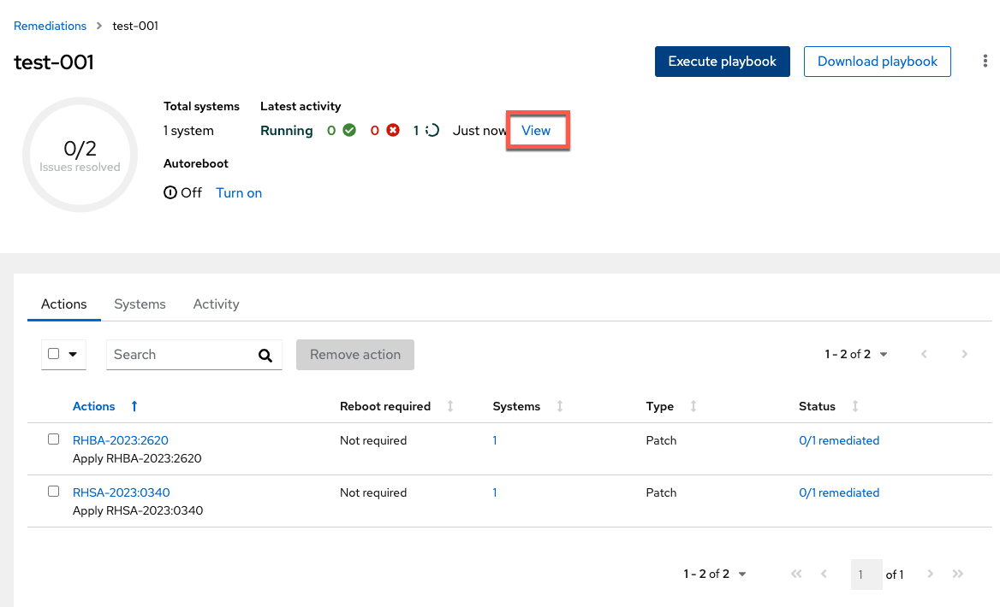

<!-- markdownlint-disable MD033 MD026-->

To demonstrate patching, we'll downgrade `podman` and `bash` before utilizing the patching application.

```bash
dnf -y downgrade bash podman
```

Next we'll run `insights-client` to update the host's metadata status the Red Hat Hybrid Cloud Console.

```bash
insights-client
```




Navigate to the `Systems` menu in the `Patch` application.



Locate your host in the list, based on its private IP address / hostname.  It should have two installable advisories (which are the packages we just downgraded).

Click on the host.


You'll be taken to the menu showing the installable advisories.


We'll upgrade `bash` first.

Click on the `Packages` tab.


Initiate the remediation by doing the following.

1) Click on the checkbox to select `bash`.
2) Click `Remediate`.


You'll be asked to `Select playbook` next. This feature is designed to enable you to create customized playbooks that include remediations detected from other Insights applications, like `Compliance` for example.

In other words, you may want to upgrade `bash` but then you might also want to remediate other problems detected by OpenSCAP (through the `Compliance` application).

Create a new playbook.

1) Select `Create a new playbook` and give it a name. In this example we'll call it `test-001`.
2) Click `Next`.

Review the correct system is selected and click `Next`.


Review the remediation and click `Submit`. Note that `Autoreboot` is enabled. This can be turned off if desired.


Here's the result. **Do not close this window.**


Click on `Open playbook test-001`.


Click on `Execute playbook`


Click on `Execute playbook on 1 system`.



You can view the execution of the remediation playbook in real-time by clicking on `View`.



<!-- Click on `Direct connected`.


Click on the `>` symbol next to the name of the host.


 -->

In the terminal, you will see the host disconnect the ssh session as it reboots.

You can go back to the patch menu for the host and the bash package will not be listed anymore.


