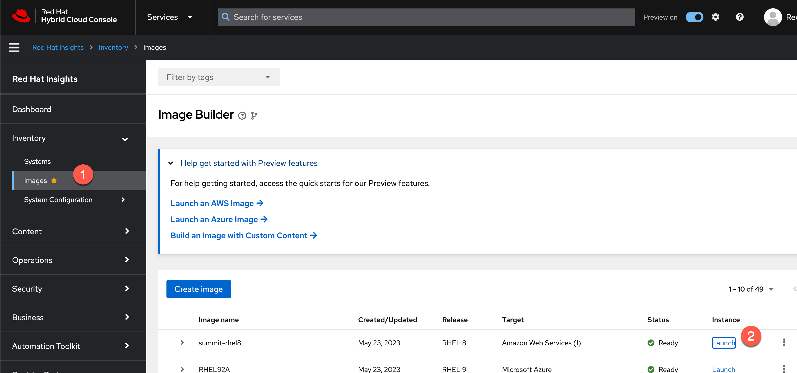
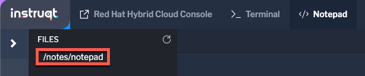
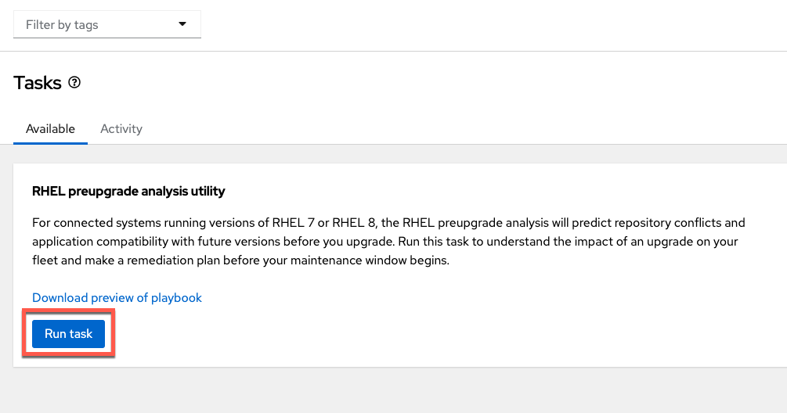

<!-- markdownlint-disable MD033 MD026-->

The RHEL preupgrade analysis utility analyzes RHEL8 and RHEL7 hosts to provide recommendations to minimize problems when upgrading to RHEL9.

First, we'll provision a RHEL8 host. Then we'll run the `RHEL preupgrade analysis utility` against it.

Launch a vm from the `summit-rhel8` image. Do the following.

1) Navigate to the `Image Builder` application.
2) Click on `Launch`, next to the `summit-rhel8` image.

The next menu will prefill several values to customize the VM instance. We'll need to choose the instance type `t2.medium` and click `Next`.

Select the SSH public key `rhte_public_key` and click `Next`.

Review the details before clicking `Launch`.

When your instance has launched successfully, copy down the ID, DNS, and SSH command. In particular, save the SSH command.

**Do not close this window.**

You can save the SSH command in the built in `Notepad`.

Then click on the `Notepad` tab.

Click on `/notes/notepad`.

Paste the SSH command into the notepad and save it by clicking on the disk icon.

Navigate to the `RHEL preupgrade analysis utility` in the `Tasks` menu under `Toolkit`.

Click on `Run task`.

Select the RHEL8 system you just provisioned and click execute.

<!--  -->

It will take a few minutes for the job to complete.

Go to the `Activity` tab and the last job run to view the analysis.

This completes all lab activities.
