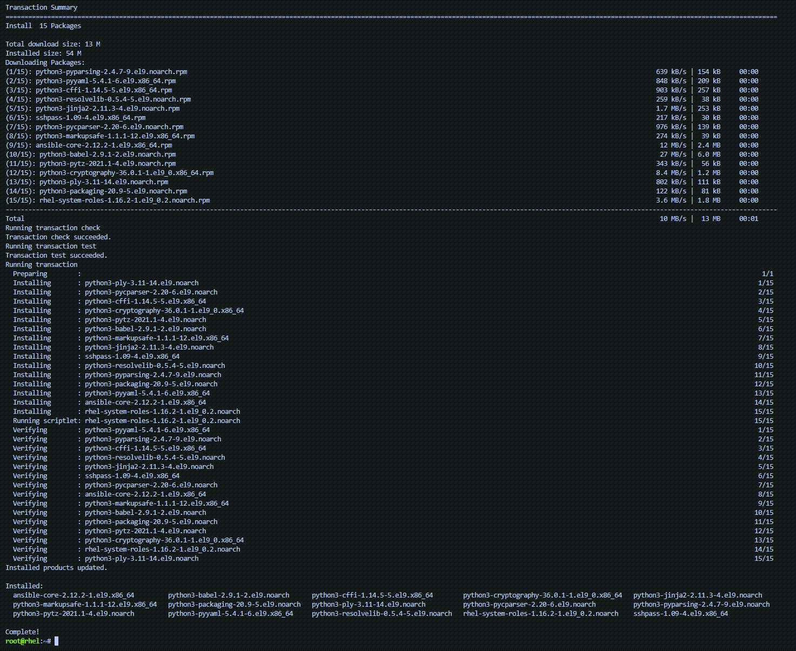

In this lab there are 4 hosts. Below is a description of them and their purpose.

| Host | Description |
|------|-----------------------------------------------------|
| `rhel` | Control node where the metrics system role will run. As well, Grafana will be installed here. |
| `rhel2` | RHEL9 host where we will collect metrics from.      |
| `rhel3` | RHEL9 host where we will collect metrics from.      |
| `rhel4` | RHEL9 host where we will collect metrics from.      |

Initially we will configure the first 3 hosts. After, we will add `rhel4` to the observability system since it is likely you will need to add additional hosts to your infrastructure well after the initial installation and configuration has taken place.

We'll start by installing RHEL System Roles on `rhel`

First, click on the menu tab labelled `rhel`.


Copy and paste the following command into the `rhel` terminal.

```bash
dnf install -y rhel-system-roles
```

The resulting output should look similar to below.



RHEL System Roles are now installed.

Install AAP.

wget <https://access.cdn.redhat.com/content/origin/files/sha256/87/878c2c2705e5f50e734f27fc7c50b39ddf4b2ace2d40290477d19477b82f9904/ansible-automation-platform-setup-bundle-2.2.1-1.tar.gz?user=5a91afa0bee688aa7665b42cf6bfe9ea>&_auth_=1664235821_567bc523facb3ca372a24a72467755e5

rhel-0ab2
Redhat1!

<https://github.com/ansible/workshops/tree/63d1ed68358aac165d73092e5e1ba7b576f9691c/roles/control_node>
