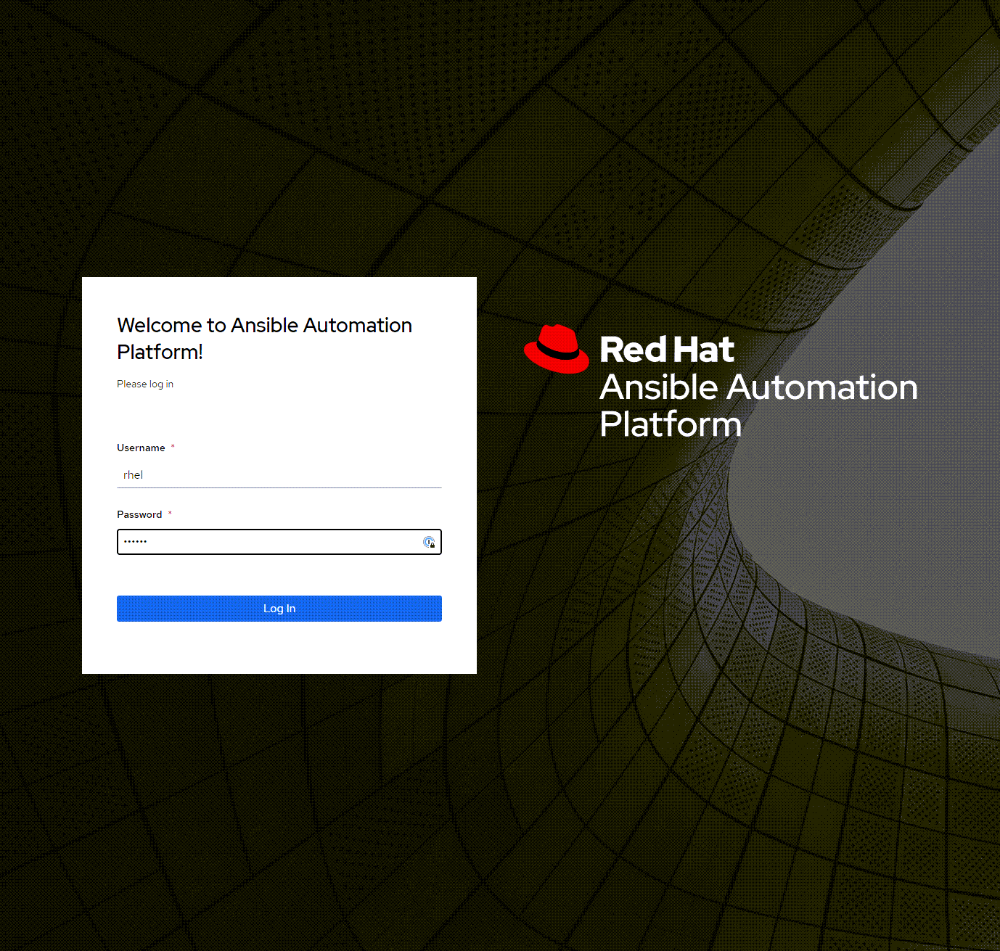

# 3538
In this lab there are 4 hosts. Below is a description of them and their purpose.

| Host | Description |
|------|-----------------------------------------------------|
| `aap` | Control node where Ansible Automation Platform is run.|
| `rhel` | RHEL9 hosts that will be configured by RHEL system roles. As well, Grafana will be installed here.      |
| `rhel2` | RHEL9 hosts that will be configured by RHEL system roles.      |
| `rhel3` | RHEL9 hosts that will be configured by RHEL system roles.      |

Ansible Automation Platform (AAP) has already been installed on the `aap` host. A basic configuration has already been performed.

Launch a new browser tab for the AAP web interface by clicking on the AAP Console button on the navigation bar.


Log into AAP with the following credentials.

### Username

```yaml
rhel
```

### Password

```yaml
redhat
```

Enter the credentials at this login page.


