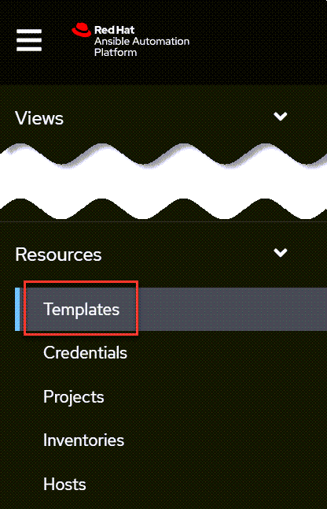
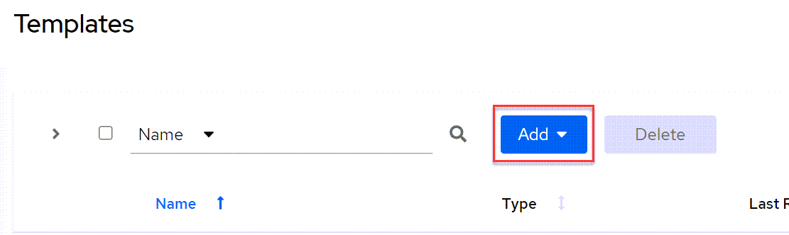
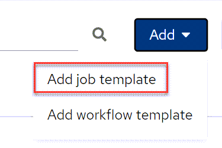
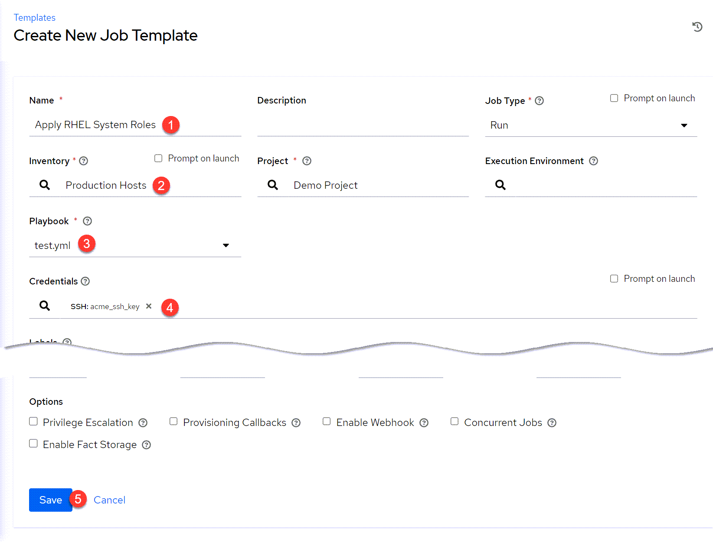

We'll create a `Template` to execute our playbook in a `Job`.

Click on `Templates`.

Click `Add`.

Select `Add job template`.

Next enter the following:

1) Give the job template a name like `Apply RHEL System Roles`.
2) Select `Production Hosts`.
3) Select the `test.yml` playbook. This playbook is imported from the git repository mentioned in the first challenge of this lab.
4) Select the `acme_ssh_key`.
5) Click `Save`.

Let's apply our RHEL system roles by launching the template we just created. Click on `Launch`.

Proceed to the next challenge after the job has completed.
