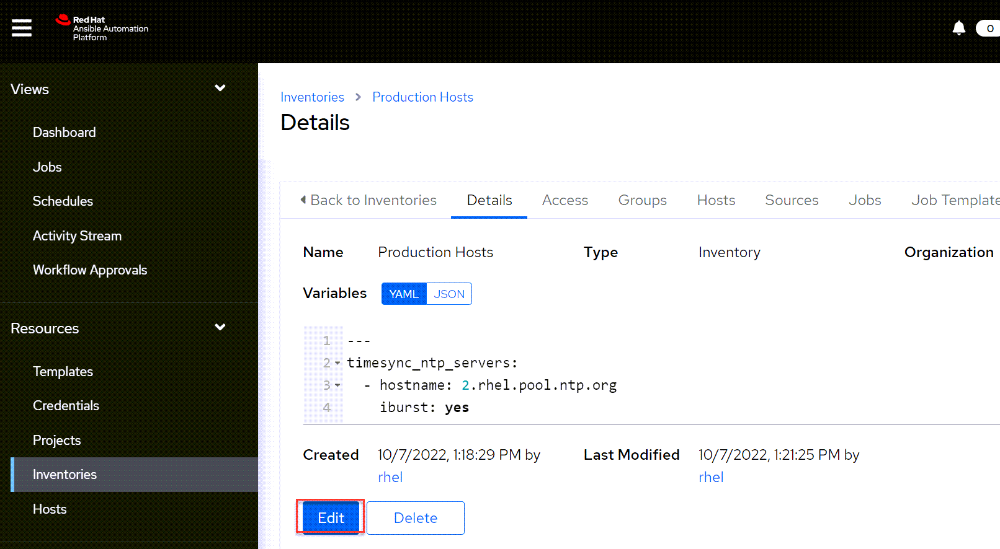
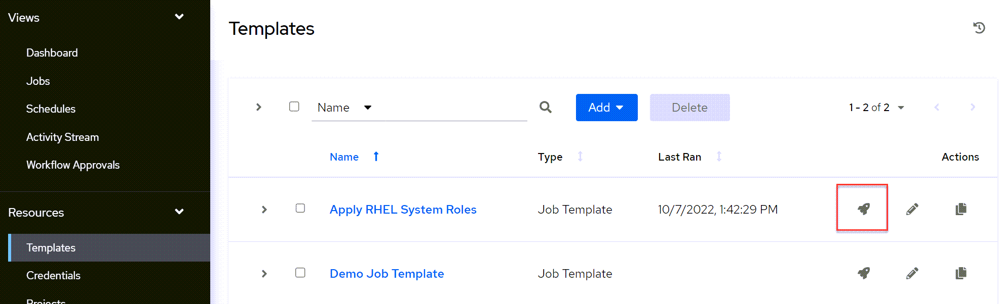
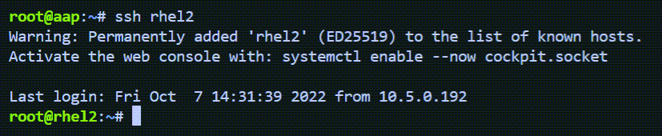
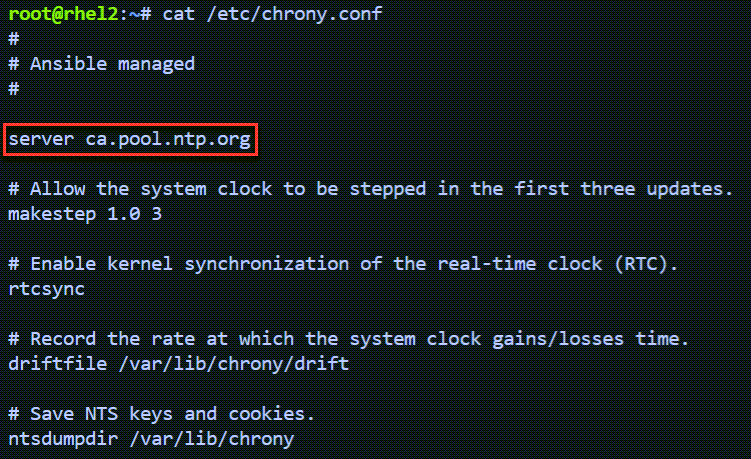
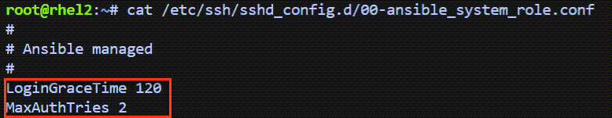

> __NOTE:__ To automatically make changes, run the following ansible playbook in the AAP terminal. If you wish to learn how to configure the RHEL system roles, please continue without running the ansible playbook.

```bash
ansible-playbook -i /root/aap_instruqt/inventory.yml /root/aap_instruqt/playbooks/modify.yml
```

Navigate to the `Production Hosts` inventory in the `Inventories` menu. Click on `Edit`.



Make the following changes:

1) Modify the NTP server to `ca.pool.ntp.org`.
2) Set `iburst` to `no`.
3) Under sshd, Change `MaxAuthTries` to `2`.
4) Change the `LoginGraceTime` to `120`.
5) Change `tlog_scope_sssd` to `some`.
6) Change `tlog_group_sssd` to `wheel`. Only `wheel` users will be recorded with tlog with these settings.

You can make the entire set of changes by copy and pasting the following.

```yaml
---
timesync_ntp_servers:
  - hostname: ca.pool.ntp.org
    iburst: no

sshd:
  MaxAuthTries: "2"
  LoginGraceTime: "120"

tlog_scope_sssd: some
tlog_groups_sssd: 
  - "wheel"

crypto_policies_policy: DEFAULT:NO-SHA1
```

Go back to `Templates` and launch the `Apply RHEL System Roles` job by clicking on the rocket icon.



When the job has completed, click on the AAP tab.


Now SSH into any of the RHEL hosts. For example:

```yaml
ssh rhel2
```

You won't need enter credentials.



Check that the modifications have been made.

### NTP Settings

```yaml
cat /etc/chrony.conf
```



### sshd settings

```yaml
cat /etc/ssh/sshd_config.d/00-ansible_system_role.conf
```



### Terminal logging

```yaml
cat /etc/sssd/conf.d/sssd-session-recording.conf
```


> __NOTE:__ To automatically make changes, run the following ansible playbook.

```bash
ansible-playbook -i /root/aap_instruqt/inventory.yml /root/aap_instruqt/playbooks/modify.yml
```
