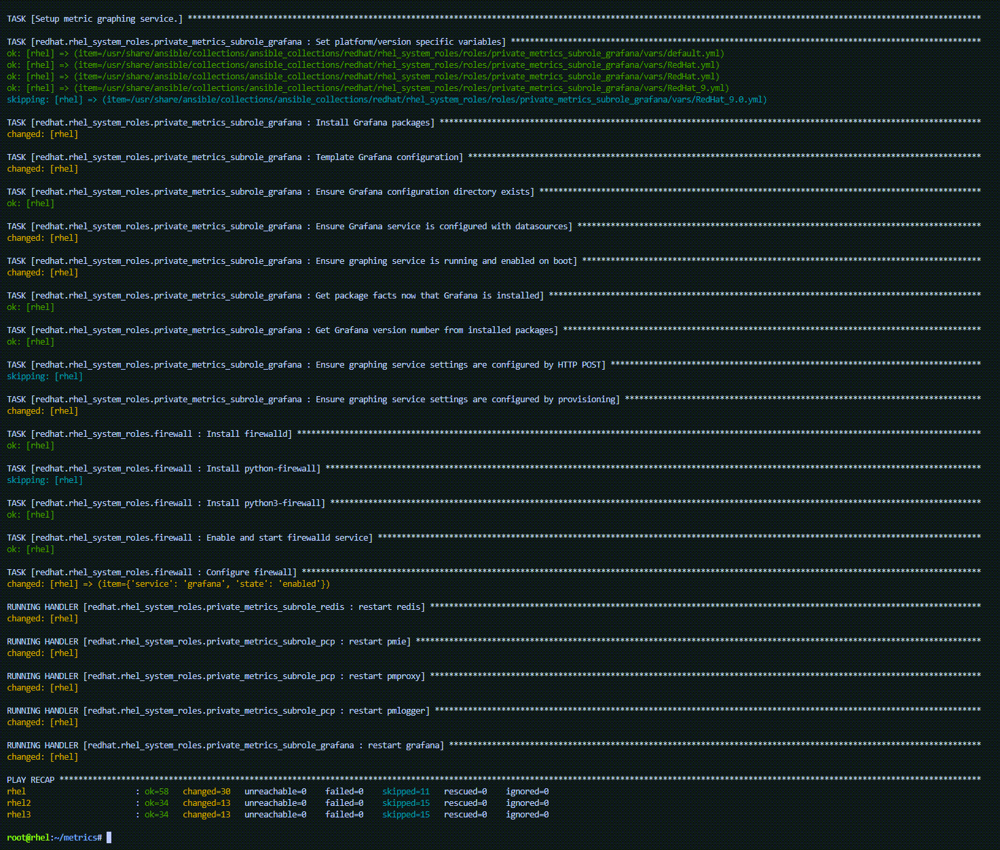

Let's create a directory to store our playbook as well as a sub-directory to store playbook variables.

```bash
mkdir -p metrics/group_vars
```

Next, we'll create an inventory file for the playbook. This inventory file contains a list of hosts and the role they will be assigned when the playbook is run. The inventory file also contains the ports that we will open to enable PCP and Grafana.

> _NOTE:_ A `README` document for RHEL System Roles is available in the `/usr/share/doc/rhel-system-roles/metrics` directory, including example playbooks.

```bash
tee -a ~/metrics/inventory.yml << EOF
all:
  children:
    servers:
      hosts:
        rhel2:
        rhel3:
      vars:
        firewall:
          - service: pmcd
            state: enabled
    metrics_monitor:
      hosts:
        rhel:
      vars:
        firewall:
          - service: grafana
            state: enabled
EOF
```

We'll configure PCP to retain 7 days worth of performance data for the `servers` specified in the inventory.

```bash
tee -a ~/metrics/group_vars/servers.yml << EOF
metrics_retention_days: 7
EOF
```

Create a configuration for the `metrics_monitor` server. The following file designates the `rhel` host to run the `metrics_graph_service` and `metrics_query_service` which are the Grafana and Redis software packages respectively.

```bash
tee -a ~/metrics/group_vars/metrics_monitor.yml << EOF
metrics_graph_service: yes
metrics_query_service: yes
metrics_retention_days: 7
metrics_monitored_hosts:  "{{ groups['servers'] }}"
EOF
```

Create the main playbook file. Notice that we are using both the `metrics` and `firewall` system roles.

```bash
tee -a ~/metrics/metrics.yml << EOF
- name: Use metrics system role to configure PCP metrics recording
  hosts: servers
  roles: 
    - redhat.rhel_system_roles.metrics
    - redhat.rhel_system_roles.firewall

- name: Use metrics system role to configure Grafana
  hosts: metrics_monitor
  roles: 
    - redhat.rhel_system_roles.metrics
    - redhat.rhel_system_roles.firewall
EOF
```

Now run the playbook.

```bash
cd metrics
ansible-playbook metrics.yml -b -i inventory.yml
```


