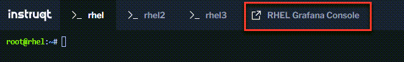

In the previous challenge, we installed Grafana on `rhel` and PCP on `rhel2` and `rhel3`.

Click on the `RHEL Grafana Console` tab.



Log into Grafana with the following credentials.

Username

```text
admin
```

Password

```text
admin
```


Upon successful login, Grafana will ask you to change the password. Skip this for now by clicking on `Skip`.


Click on `Data Sources`.


Click on `PCP Redis`.


Click on `Save & Test`.


Here's what a successful result should look like.


Click on the `Dashboards` tab.


Click on `Import` next to the `PCP Redis: Host Overview` title bar.


Click on `PCP Redis: Host Overview`.


A dashboard showing the performance metrics for the `rhel` host will be displayed.


You can see that only a small amount of data has been collected since the graph lines are short.

To view the performance metrics for the `rhel2` and `rhel3` host, click the `host` dropdown bar.


