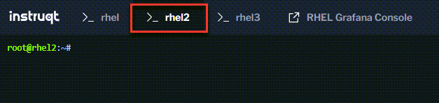
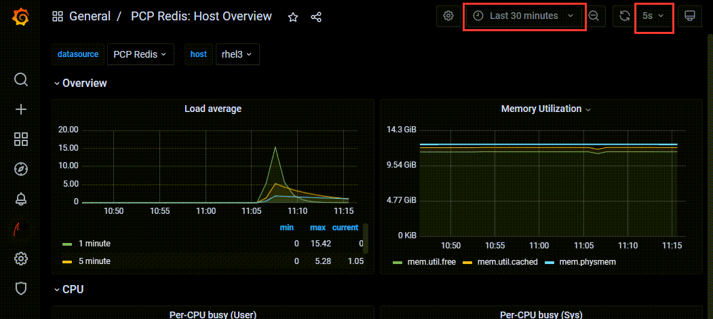

Let's run a stress test on `rhel2` and `rhel3`

Click on the `rhel2` terminal tab.



Paste the following command.

```bash
stress --cpu 16 --io 3 --vm 5 --vm-bytes 128M --timeout 60s
```

`stress` is a utility for generating artificial loads on cpu, memory, and disk. You can play around with the `--cpu`, `--io`, and `--vm` flags to generate different loads. `--timeout` specifies the duration of the test.

Click on `rhel3` terminal tab and paste the same or similar `stress` command as above to generate an artificial load.

When these `stress` tests are complete, go back to the Grafana dashboard and view the performance metrics of the `rhel2` and `rhel3` hosts. The dashboards might take a minute or two to update.

You can also experiment with the dash board scales and intervals.


