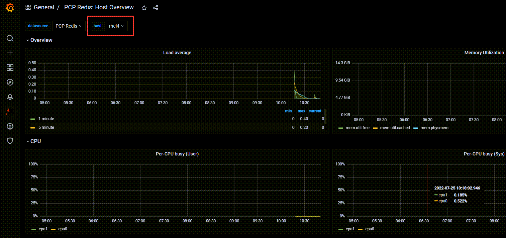

```bash
all:
  children:
    servers:
      hosts:
        rhel4:
      vars:
        firewall:
          - service: pmcd
            state: enabled
        metrics_retention_days: 7
    metrics_monitor:
      hosts:
        rhel:
      vars:
        metrics_monitored_hosts:  "{{ groups['servers'] }}"
```

So far we have configured 2 RHEL hosts (`rhel2`, `rhel3`) to be monitored and have their performance metrics collected by host running Grafana and Redis (`rhel`). We'll now edit the play book to configure and add another host `rhel4`. This exercise is useful as you add more and more hosts to your datacenter.

The following configuration file will install PCP on the host `rhel4`. As well, it will tell the `rhel` Grafana host to monitor `rhel4`, in addition to the other hosts. Copy and paste this to the cli and press enter.

```bash
tee -a ~/metrics/addrhel4.yml << EOF
all:
  children:
    servers:
      hosts:
        rhel4:
      vars:
        firewall:
          - service: pmcd
            state: enabled
        metrics_retention_days: 7
    metrics_monitor:
      hosts:
        rhel:
      vars:
        metrics_monitored_hosts:  "{{ groups['servers'] }}"
EOF
```

The following configuration file will configure the playbook to run on `rhel4` and `rhel` but skip configuring the firewall on `rhel` since we've already done it. Copy and paste this to the cli and press enter.

```bash
tee -a ~/metrics/metrics.yml << EOF
- name: Use metrics system role to configure PCP metrics recording
  hosts: servers
  roles:
    - redhat.rhel_system_roles.metrics
    - redhat.rhel_system_roles.firewall

- name: Use metrics system role to configure Grafana
  hosts: metrics_monitor
  roles:
    - redhat.rhel_system_roles.metrics
EOF
```

Now go back to the Grafana dashboard. You should be able to see `rhel4` has been added and metrics are being collected.



Congratulations on completing this lab!

For more information on RHEL System Roles, please consider browsing the following:

- [Automate performance metrics collection and visualization with RHEL System Roles](https://www.redhat.com/en/blog/automate-performance-metrics-collection-and-visualization-rhel-system-roles)
- [Red Hat Enterprise Linux System Roles blog series](https://www.redhat.com/en/blog/red-hat-enterprise-linux-system-roles).
- [Administration and configuration tasks using System Roles in RHEL](https://access.redhat.com/documentation/en-us/red_hat_enterprise_linux/9/html/administration_and_configuration_tasks_using_system_roles_in_rhel)
