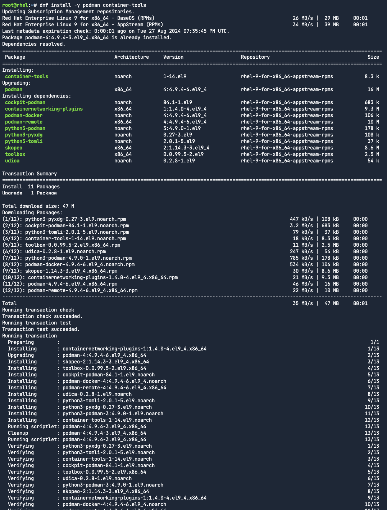

Install Podman
===
The first task is to install Podman.

Click on the `run` button for the code block below.

```bash,run
dnf install -y podman
```
The output should look similar to the following screenshot.



Proceed to the next assignment.
