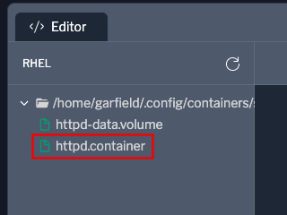
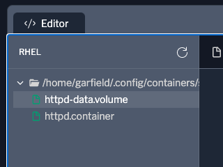
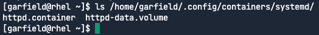

Now we'll configure the `httpd.container` and `httpd-data.volume` files.

Edit the httpd.container file
===
Switch to the `Editor` tab by clicking this button: [button label="Editor" background="#ee0000" color="#c7c7c7"](tab-1)
In the `Editor` tab, click on `httpd.container`.


Copy and paste the following code blog into the editor. Once pasted, the editor will automatically save the file.
```ini
[Service]
Restart=always

[Container]
ContainerName=httpd
Image=docker.io/library/httpd
Label="io.containers.autoupdate=registry"
Environment=TZ=America/Vancouver
Environment=VERSION=docker
Volume=httpd-data.volume:/usr/local/apache2/htdocs:Z
PublishPort=8080:80/tcp

[Install]
WantedBy=default.target

```
The `[Service]` section specifies that the `httpd.container` service should always be restarted regardless if it was shut down cleanly.

The `[Container]` section specifies the following:
1) `ContainerName` is `httpd`.
2) `Image` defines where to pull the image from. In this case, it is being pulled from the docker.io public registry.
3) `Volume` defines that the directory inside of the container `/usr/local/apache2/htdocs` should be exposed to the host so that the user `garfield` can edit the contents.
4) `PublishPort` defines port 8080 on the host should map to port 80 in the container.

Edit the httpd-data.volume file
===
In the `Editor` tab, click on `httpd-data.volume`.

Copy and paste the following code blog into the editor.
```ini
[Volume]
User=garfield
Group=garfield

```
The `Volume` section specifies that the user `garfield` and members of the group `garfield` have rights to modify the persistent volume that will be created.

Verify configuration files have been created successfully
===
Let's check that the configuration files have been created and saved.
Switch to the `rhel` terminal by clicking this button: [button label="rhel" background="#ee0000" color="#c7c7c7"](tab-0)

Run the following command to find the unit files we just saved.
```bash,run
ls /home/garfield/.config/containers/systemd/
```


Run the following to view the contents of `httpd.container`.
```bash,run
cat /home/garfield/.config/containers/systemd/httpd.container
```

Run the following to view the contents of `httpd-data.volume`.
```bash,run
cat /home/garfield/.config/containers/systemd/httpd-data.volume
```

If you were to create multiple container services, all the unit files will be stored in `/home/garfield/.config/containers/systemd/`.
