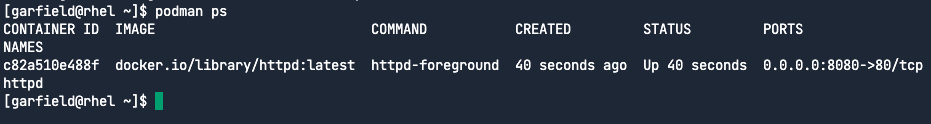
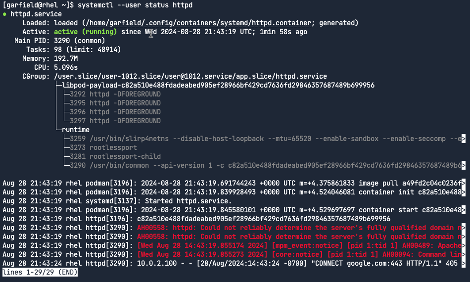
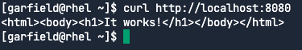
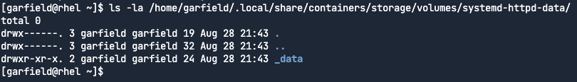
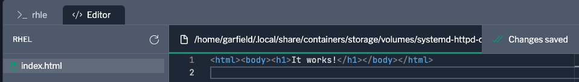
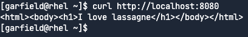

We'll check the service is running properly and then modify the index.html through the persistent volume.

Check the service
===
In the [button label="rhel" background="#ee0000" color="#c7c7c7"](tab-0)  terminal, run the following command to check that the httpd container is running.
```bash,run
podman ps
```


Let's check the systemd service is running the container.
```bash,run
systemctl --user status httpd --no-pager
```


You can stop and start the httpd service with the following commands.

To stop the httpd service.
```bash
systemctl --user stop httpd
```

To start the httpd service.
```bash
systemctl --user start httpd
```

Now let's check that the web server actually works.
```bash,run
curl http://localhost:8080
```


Modify index.html
===
Let's modify the index.html of the web server. We do this by editing the index.html file without having to initiate a terminal connection into the container. We can directly modify the index.html file through the persistent volume mapping.

Persistent volumes for all rootless container services are located in `/home/garfield/.local/share/containers/storage/volumes/`.  For our httpd service, recall that we defined the `httpd-data.volume` file. The volume is contained in `systemd-httpd-data/`.
```bash,run
ls -la /home/garfield/.local/share/containers/storage/volumes/systemd-httpd-data/
```


Notice that the `_data` directory is owned by garfield:garfield as we specified in the `httpd-data.volume` unit file.

Switch to the Editor tab by clicking on this button: [button label="Editor" background="#ee0000" color="#c7c7c7"](tab-1)


Change the sentence `It works!` to `I love lasagna.`.
```text
I love lasagna
```

Switch back to the [button label="rhel" background="#ee0000" color="#c7c7c7"](tab-0) terminal.
Run the curl command again.
```bash,run
curl http://localhost:8080
```

