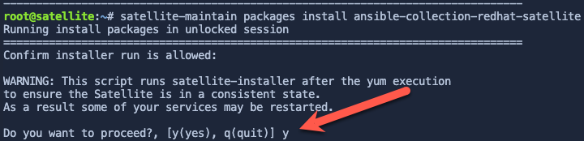
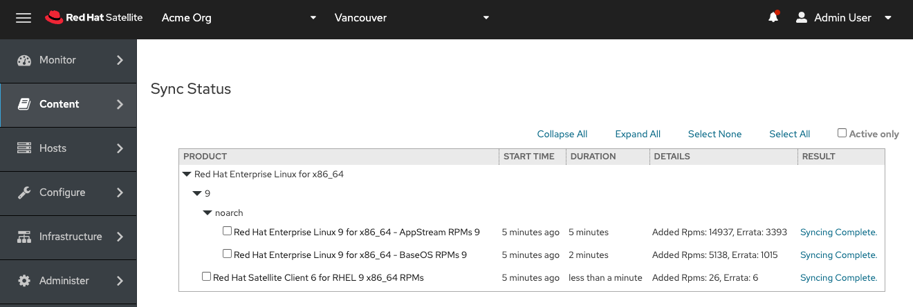

The first activity in this lab is to create an ansible playbook to automatically configure the Satellite server. Red Hat provides an Ansible collection to manage Red Hat Satellite configuration. Ansible playbooks configured to configure Satellite are useful for building disaster recovery instances of Satellite, or any other task that requires a second Satellite server, including testing, and upgrades.

Documentation for the Satellite Ansible collection can be found [here](https://console.redhat.com/ansible/automation-hub/repo/published/redhat/satellite/docs) (Red Hat account required).

Install the Satellite Ansible collection
========================================

Copy and paste this into the `Satellite Server` terminal.
```
satellite-maintain packages install ansible-collection-redhat-satellite
```

When prompted to proceed, enter `y`.



Create a playbook to enable RHEL9 repositories
==============================================

The playbook below is simply an example. Never put passwords in your playbook.

Copy and paste the code block below into the `Satellite Server` terminal, then run it.


```bash
tee ~/config.yml << EOF
---
- name: Configure Satellite 6.14
  hosts: localhost
  remote_user: root

  tasks:
  - name: "Enable RHEL 9 BaseOS RPMs repository with label"
    redhat.satellite.repository_set:
      username: "admin"
      password: "bc31c9a6-9ff0-11ec-9587-00155d1b0702"
      server_url: "https://satellite.lab"
      organization: "Acme Org"
      label: rhel-9-for-x86_64-baseos-rpms
      repositories:
        - releasever: "9"

  - name: "Enable RHEL 9 AppStream RPMs repository with label"
    redhat.satellite.repository_set:
      username: "admin"
      password: "bc31c9a6-9ff0-11ec-9587-00155d1b0702"
      server_url: "https://satellite.lab"
      organization: "Acme Org"
      label: rhel-9-for-x86_64-appstream-rpms
      repositories:
        - releasever: "9"

  - name: "Satellite 6 client repository with label without specifying base arch"
    redhat.satellite.repository_set:
      username: "admin"
      password: "bc31c9a6-9ff0-11ec-9587-00155d1b0702"
      server_url: "https://satellite.lab"
      organization: "Acme Org"
      label: satellite-client-6-for-rhel-9-x86_64-rpms
      all_repositories: true
      state: enabled

  - name: "Create and activation key."
    redhat.satellite.activation_key:
      username: "admin"
      password: "bc31c9a6-9ff0-11ec-9587-00155d1b0702"
      server_url: "https://satellite.lab"
      name: "RHEL9"
      organization: "Acme Org"
      lifecycle_environment: "Library"
      content_overrides:
          - label: satellite-client-6-for-rhel-9-x86_64-rpms
            override: enabled

  - name: "Sync all repositories"
    redhat.satellite.repository_sync:
      username: "admin"
      password: "bc31c9a6-9ff0-11ec-9587-00155d1b0702"
      server_url: "https://satellite.lab"
      product: "Red Hat Enterprise Linux for x86_64"
      organization: "Acme Org"
EOF
```

The first two playbook tasks, `Enable RHEL 9 BaseOS RPMs repository with label` and `Enable RHEL 9 AppStream RPMs repository with label` will enable the RHEL 9 BaseOS and AppStream repositories.

The third task enables the `satellite-client-6-for-rhel-9-x86_64-rpms` repository. This task enables the repository without specifying base arch (as some repos do no require it). The Satellite 6 client repo contains software such as `Tracer` and `yggdrasild`. `yggdrasild` will be required later in the lab to enable Remote Execution Pull Mode.

The fourth task creates an `activation key` which is used to control access to repositories on Satellite. In this particular `activation key`, the Satellite 6 client repository is overridden to enabled.

The fifth task initiates a synchronization operation on all `Red Hat Enterprise Linux for x86_64` product repositories.

Execute the playbook
====================

Execute the playbook with the following command.

```
ansible-playbook config.yml -vvv
```

The task `Synchronize all repositories` takes about 5 minutes. Please do not advance to the next activity in this lab until the repositories have completed synchronizing.

View the progress of the repository sync
========================================

Navigate to the `Sync Status` menu.


Click `Expand All`.


It should take about 5 minutes for the repos to sync.

