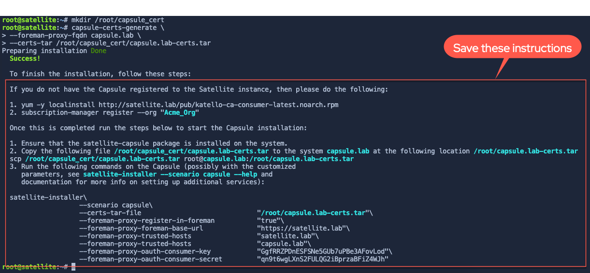
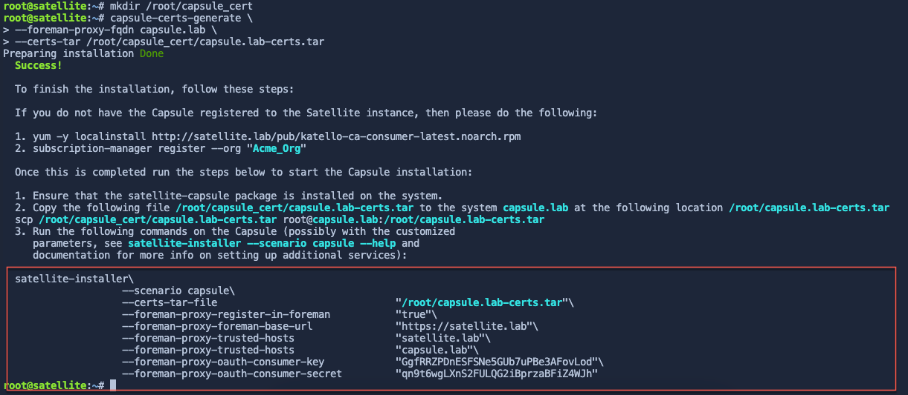
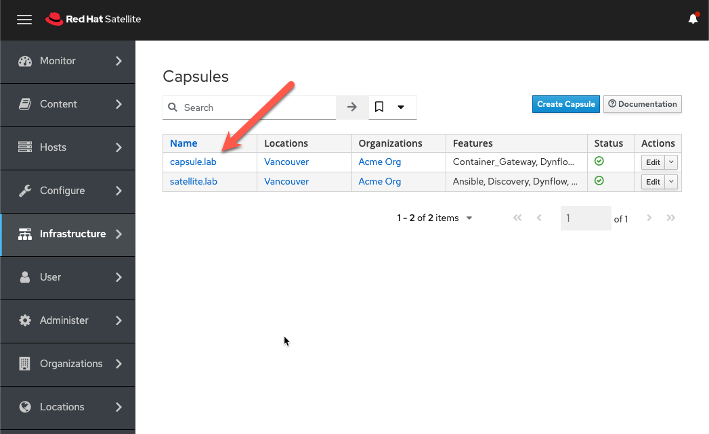
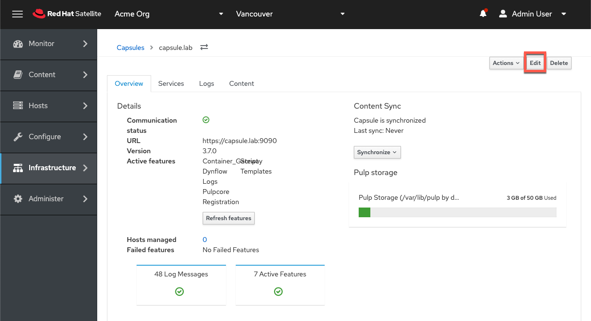
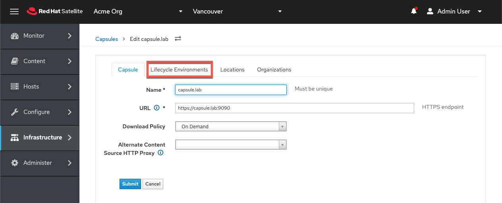
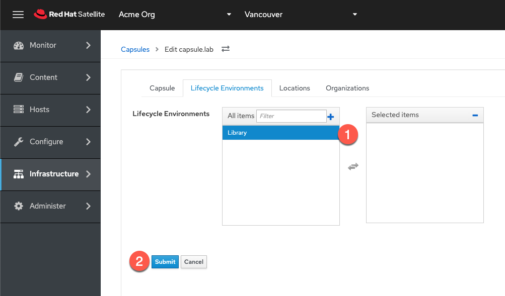

In this challenge, we'll configure the host `capsule.lab` as a Capsule server.

Red Hat Satellite Capsule Servers mirror content from Red Hat Satellite Server to facilitate content federation across various geographical locations. Host systems can pull content from the Capsule Server and not from the central Satellite Server. The Capsule Server also provides localized services such as Puppet Master, DHCP, DNS, or TFTP. Capsule Servers assist you in scaling your Satellite environment as the number of your managed systems increases.

Capsule Servers decrease the load on the central server, increase redundancy, and reduce bandwidth usage. 

Register the Capsule host with Satellite.
=========================================
First, register the host `capsule` with satellite.

You can generate a host registration script on the `Satellite Server` terminal with the following command.

```
hammer host-registration generate-command --insecure 1 --setup-insights 0 --force 1 --activation-key RHEL9
```

Copy the output of this command from the `Satellite Server` terminal, paste it into the `Capsule` terminal, and run it.

Synchronize the repositories containing capsule server software to the Satellite server
================================================================================

In the very first challenge of this lab, we created a playbook to add and synchronize repositories containing capsule server software to Satellite.
- `rhel-8-for-x86_64-baseos-rpms`
- `rhel-8-for-x86_64-appstream-rpms`
- `satellite-capsule-6.14-for-rhel-8-x86_64-rpms`
- `satellite-maintenance-6.14-for-rhel-8-x86_64-rpms`

We don't need to run this playbook again but a playbook has been added for your reference.

Notice that the `Modify activation key` task of the playbook overrides the aforementioned repositories to `enabled`, providing `capsule` access to the repos.

```
tee ~/capsulerepos.yml << EOF
---
- name: Add and sync capsule server repositories.
  hosts: localhost
  remote_user: root

  tasks:
  - name: "Enable RHEL 8 BaseOS RPMs repository with label"
    redhat.satellite.repository_set:
      username: "admin"
      password: "bc31c9a6-9ff0-11ec-9587-00155d1b0702"
      server_url: "https://satellite.lab"
      organization: "Acme Org"
      label: rhel-8-for-x86_64-baseos-rpms
      repositories:
        - releasever: "8"

  - name: "Enable RHEL 8 AppStream RPMs repository with label"
    redhat.satellite.repository_set:
      username: "admin"
      password: "bc31c9a6-9ff0-11ec-9587-00155d1b0702"
      server_url: "https://satellite.lab"
      organization: "Acme Org"
      label: rhel-8-for-x86_64-appstream-rpms
      repositories:
        - releasever: "8"

  - name: "Satellite capsule software for 6.14"
    redhat.satellite.repository_set:
      username: "admin"
      password: "bc31c9a6-9ff0-11ec-9587-00155d1b0702"
      server_url: "https://satellite.lab"
      organization: "Acme Org"
      label: satellite-capsule-6.14-for-rhel-8-x86_64-rpms
      all_repositories: true
      state: enabled

  - name: "Satellite maintenance software for 6.14"
    redhat.satellite.repository_set:
      username: "admin"
      password: "bc31c9a6-9ff0-11ec-9587-00155d1b0702"
      server_url: "https://satellite.lab"
      organization: "Acme Org"
      label: satellite-maintenance-6.14-for-rhel-8-x86_64-rpms
      all_repositories: true
      state: enabled

  - name: "Modify activation key."
    redhat.satellite.activation_key:
      username: "admin"
      password: "bc31c9a6-9ff0-11ec-9587-00155d1b0702"
      server_url: "https://satellite.lab"
      name: "RHEL9"
      organization: "Acme Org"
      lifecycle_environment: "Library"
      content_overrides:
          - label: satellite-client-6-for-rhel-9-x86_64-rpms
            override: enabled
          - label: satellite-maintenance-6.14-for-rhel-8-x86_64-rpms
            override: enabled
          - label: satellite-capsule-6.14-for-rhel-8-x86_64-rpms
            override: enabled

  - name: "Sync all RHEL repositories"
    redhat.satellite.repository_sync:
      username: "admin"
      password: "bc31c9a6-9ff0-11ec-9587-00155d1b0702"
      server_url: "https://satellite.lab"
      product: "Red Hat Enterprise Linux for x86_64"
      organization: "Acme Org"

  - name: "Sync Satellite Capsule repository"
    redhat.satellite.repository_sync:
      username: "admin"
      password: "bc31c9a6-9ff0-11ec-9587-00155d1b0702"
      server_url: "https://satellite.lab"
      product: "Red Hat Satellite Capsule"
      organization: "Acme Org"
EOF
```

Configure the repositories on the Capsule host.
===============================================

To install the capsule software, we have to configure the correct repositories. Run the following command to disable repos.

```
subscription-manager repos --disable "*"
```

Now enable the repositories we synchronized and overrode to enabled in the previous step.

```
subscription-manager repos --enable=rhel-8-for-x86_64-baseos-rpms \
--enable=rhel-8-for-x86_64-appstream-rpms \
--enable=satellite-capsule-6.14-for-rhel-8-x86_64-rpms \
--enable=satellite-maintenance-6.14-for-rhel-8-x86_64-rpms
```

Enable the satellite module.

```
dnf module enable satellite-capsule:el8 -y
```

Install the capsule software.
=============================

Update the host `capsule.lab` by entering the following command in the `Capsule` terminal.

```
dnf update -y
```

Next, install the capsule software.

```
dnf install satellite-capsule -y
```

Configure the Capsule Server with a Default SSL Certificate
===========================================================

On the Satellite server, in the `Satellite Server` terminal, create a directory to store the SSL certificate.

```
mkdir /root/capsule_cert
```

Generate the capsule certificate by entering the following in the `Satellite Server` terminal.

```
capsule-certs-generate \
--foreman-proxy-fqdn capsule.lab \
--certs-tar /root/capsule_cert/capsule.lab-certs.tar
```

Notice that FQDN for the capsule server, `capsule.lab` must be specified.

Here's what the output should look like.



Note the instructions in the output of the command. You'll need these!

Copy the certificate from `satellite.lab` to `capsule.lab`.

```
scp /root/capsule_cert/capsule.lab-certs.tar capsule.lab:/root/capsule.lab-certs.tar
```


As per the instructions from the output of the `capsule-cert-generate`, copy, paste and run the `satellite-installer` command in the `Capsule` terminal.



Here's what the output should look like.


Configure `satellite.lab` to replicate the `Library` lifecycle environment to `capsule.lab`
===========================================================================================

In the `Satellite Web UI`, navigate to the capsule menu.


You should see the capsule server.

Click on `capsule.lab`



Click on `Edit`.



Click on `Lifecycle Environments`.



Configure `satellite.lab` to synchronize the `Library` lifecycle environment to `capsule.lab`.
1) Click on `Library`.
2) Click `Submit`.



__A note about the configuration:__


We left the `Download Policy` on the default setting of `On Demand`. This means that metadata will be synchronized to the capsule server but the software will only be synchronized on demand, when a host makes the request to the capsule server to install software.