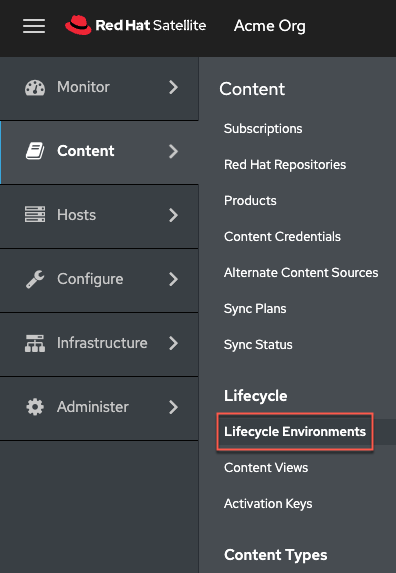
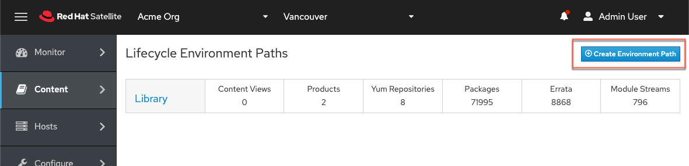
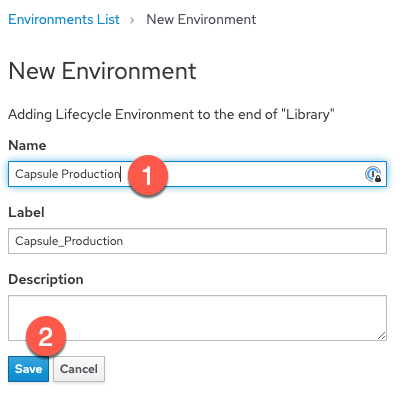
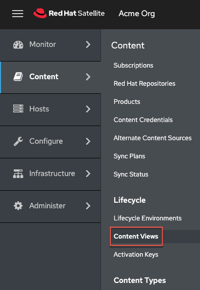
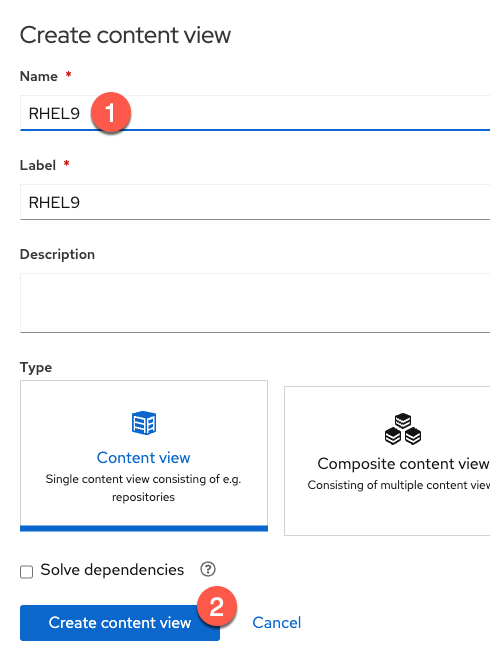
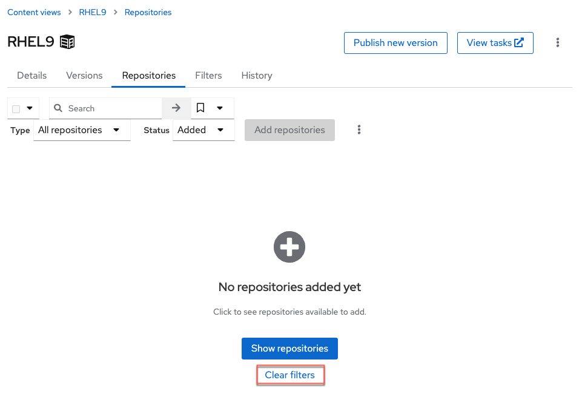

In this challenge, we'll configure the host `capsule.lab` as a Capsule server.

Red Hat Satellite Capsule Servers mirror content from Red Hat Satellite Server to facilitate content federation across various geographical locations. Host systems can pull content from the Capsule Server and not from the central Satellite Server. The Capsule Server also provides localized services such as Puppet Master, DHCP, DNS, or TFTP. Capsule Servers assist you in scaling your Satellite environment as the number of your managed systems increases.

Capsule Servers decrease the load on the central server, increase redundancy, and reduce bandwidth usage.

# Synchronize the repositories containing capsule server software to the Satellite server

We need to provide the following repositories to the capsule server.

- `rhel-8-for-x86_64-baseos-rpms`
- `rhel-8-for-x86_64-appstream-rpms`
- `satellite-capsule-6.14-for-rhel-8-x86_64-rpms`
- `satellite-maintenance-6.14-for-rhel-8-x86_64-rpms`

Copy and paste the following playbook to the satellite server in the `Satellite server` terminal.

```
tee ~/capsulerepos.yml << EOF
---
- name: Add and sync capsule server repositories.
  hosts: localhost
  remote_user: root

  tasks:
  - name: "Enable RHEL 8 BaseOS RPMs repository with label"
    redhat.satellite.repository_set:
      username: "admin"
      password: "bc31c9a6-9ff0-11ec-9587-00155d1b0702"
      server_url: "https://satellite.lab"
      organization: "Acme Org"
      label: rhel-8-for-x86_64-baseos-rpms
      repositories:
        - releasever: "8"

  - name: "Enable RHEL 8 AppStream RPMs repository with label"
    redhat.satellite.repository_set:
      username: "admin"
      password: "bc31c9a6-9ff0-11ec-9587-00155d1b0702"
      server_url: "https://satellite.lab"
      organization: "Acme Org"
      label: rhel-8-for-x86_64-appstream-rpms
      repositories:
        - releasever: "8"

  - name: "Satellite 6 client repository with label without specifying base arch"
    redhat.satellite.repository_set:
      username: "admin"
      password: "bc31c9a6-9ff0-11ec-9587-00155d1b0702"
      server_url: "https://satellite.lab"
      organization: "Acme Org"
      label: satellite-client-6-for-rhel-8-x86_64-rpms
      all_repositories: true
      state: enabled

  - name: "Satellite capsule software for 6.14"
    redhat.satellite.repository_set:
      username: "admin"
      password: "bc31c9a6-9ff0-11ec-9587-00155d1b0702"
      server_url: "https://satellite.lab"
      organization: "Acme Org"
      label: satellite-capsule-6.14-for-rhel-8-x86_64-rpms
      all_repositories: true
      state: enabled

  - name: "Satellite maintenance software for 6.14"
    redhat.satellite.repository_set:
      username: "admin"
      password: "bc31c9a6-9ff0-11ec-9587-00155d1b0702"
      server_url: "https://satellite.lab"
      organization: "Acme Org"
      label: satellite-maintenance-6.14-for-rhel-8-x86_64-rpms
      all_repositories: true
      state: enabled

  - name: "Create activation key for capsule."
    redhat.satellite.activation_key:
      username: "admin"
      password: "bc31c9a6-9ff0-11ec-9587-00155d1b0702"
      server_url: "https://satellite.lab"
      name: "RHEL8"
      organization: "Acme Org"
      lifecycle_environment: "Library"
      content_overrides:
          - label: satellite-client-6-for-rhel-8-x86_64-rpms
            override: enabled
          - label: satellite-maintenance-6.14-for-rhel-8-x86_64-rpms
            override: enabled
          - label: satellite-capsule-6.14-for-rhel-8-x86_64-rpms
            override: enabled

  - name: "Sync all RHEL repositories"
    redhat.satellite.repository_sync:
      username: "admin"
      password: "bc31c9a6-9ff0-11ec-9587-00155d1b0702"
      server_url: "https://satellite.lab"
      product: "Red Hat Enterprise Linux for x86_64"
      organization: "Acme Org"

  - name: "Sync Satellite Capsule repository"
    redhat.satellite.repository_sync:
      username: "admin"
      password: "bc31c9a6-9ff0-11ec-9587-00155d1b0702"
      server_url: "https://satellite.lab"
      product: "Red Hat Satellite Capsule"
      organization: "Acme Org"
EOF
```

Notice that the `Modify activation key` task of the playbook overrides the aforementioned repositories to `enabled`, providing `capsule` access to the repos.

Run the playbook.

```
ansible-playbook capsulerepos.yml
```

The RHEL 8 repositories were synchronized in the background of this lab. The synchronization step should only take a few seconds.

# Register the Capsule host with Satellite.

First, register the host `capsule` with satellite.

You can generate a host registration script on the `Satellite Server` terminal with the following command.
**Note:** this is a different registration script from those previously generated in this lab and provides access to RHEL 8 repos.

```
hammer host-registration generate-command --insecure 1 --setup-insights 0 --force 1 --activation-key RHEL8
```

Copy the output of this command from the `Satellite Server` terminal, paste it into the `Capsule` terminal, and run it.

# Update the `capsule.lab` host.

In the `Capsule` terminal, run the following.

```
dnf update -y && reboot
```

The `Capsule` terminal will lose connection with the host during reboot. To reconnect the `Capsule` terminal, click the following button.


# Configure the repositories on the Capsule host.

To install the capsule software, we have to configure the correct repositories. Run the following command in the `Capsule` terminal to disable repos.

```
subscription-manager repos --disable "*"
```

Now enable the repositories the required repositories.

```
subscription-manager repos --enable=rhel-8-for-x86_64-baseos-rpms \
--enable=rhel-8-for-x86_64-appstream-rpms \
--enable=satellite-capsule-6.14-for-rhel-8-x86_64-rpms \
--enable=satellite-maintenance-6.14-for-rhel-8-x86_64-rpms
```

Enable the satellite module.

```
dnf module enable satellite-capsule:el8 -y
```

# Install the capsule software.

Run the following command to install the capsule software.

```
dnf install satellite-capsule -y
```

# Export the Default SSL Certificate from the Satellite server

On the **Satellite server**, in the `Satellite Server` terminal, create a directory to store the SSL certificate.

```
mkdir /root/capsule_cert
```

Generate the capsule certificate by entering the following in the `Satellite Server` terminal.

```
capsule-certs-generate \
--foreman-proxy-fqdn capsule.lab \
--certs-tar /root/capsule_cert/capsule.lab-certs.tar
```

Notice that FQDN for the capsule server, `capsule.lab` must be specified.

Here's what the output should look like.


Note the instructions in the output of the command. You'll need these!

Copy the certificate from `satellite.lab` to `capsule.lab`.

```
scp -o StrictHostKeyChecking=no /root/capsule_cert/capsule.lab-certs.tar capsule.lab:/root/capsule.lab-certs.tar
```


# Import the default certificate into the Capsule server

As per the instructions from the output of the `capsule-cert-generate`, copy, paste and run the `satellite-installer` command in the `Capsule` terminal.


Here's what the output should look like.


# Configure lifecycle environment and content views

At present, the capsule server `capsule.lab` cannot provide any software. To do so, we must synchronize metadata to `capsule.lab`, that is, information about the software and repositories available to `satellite.lab`. It is possible to synchronize all metadata and software packages to `capsule.lab` but it can take a lot of time and consume a lot of storage. We control the synchronization of software repositories to capsule servers through lifecycle environments.

The `satellite.lab` server only has a single lifecycle environment (LCE) named `Library`. `Library` is a default LCE and contains all repositories. To synchronize all metadata (we have not specified that all software must be synchronized), we could tell satellite to synchronize the entire `Library` LCE to the capsule.

In a real-life environment, it is not always practical or desireable to synchronize all software to capsule servers since it could take a long time and consume a vast amount of storage.

Content views are used to specify repositories and provide granular control of specific RPM package versions that can be added to a lifecycle environment. We'll use a combination of a content view and an LCE to synchronize RHEL 9 BaseOS, AppStream, and Satellite Client software to the capsule server `capsule.lab`.

To read more about lifecycle environments, please refer to the official documentation [here](https://access.redhat.com/documentation/en-us/red_hat_satellite/6.14/html/managing_content/managing_application_lifecycles_content-management).

To read more about content views, please refer to the official documentation [here](https://access.redhat.com/documentation/en-us/red_hat_satellite/6.14/html/managing_content/managing_content_views_content-management).

## Create a lifecycle environment

Navigate to `Lifecycle Environments`.



Click on `Create Environment Path`.



Do the following.

1. Name the LCE.
2. Click `Save`.



## Create a content view

Navigate to `Content Views`.



Click `Create content view`.


Do the following.

1) Name the content view.
2) Click `Create content view`



You'll be taken to the `Repositories` tab of the content view you just created. Click on the `Clear filters` button to view all repositories that can be added to this content view.



Do the following.

1) Select `RHEL9 BaseOS` repository. We won't add additional repos in order to save time.
2)

# Configure `satellite.lab` to replicate the `Library` lifecycle environment to `capsule.lab`

In the `Satellite Web UI`, navigate to the capsule menu.


You should see the capsule server.

Click on `capsule.lab`


Click on `Edit`.


Click on `Lifecycle Environments`.


Configure `satellite.lab` to synchronize the `Library` lifecycle environment to `capsule.lab`.

1. Click on `Library`.
2. Click `Submit`.


**A note about the configuration:**


We left the `Download Policy` on the default setting of `On Demand`. This means that metadata will be synchronized to the capsule server but the software will only be synchronized on demand, when a host makes the request to the capsule server to install software.

# [Optional]Synchronize software with the capsule server and migrate `rhel1`.

The following operation is time consuming due to resource constraints on the capsule server and the size of the repositories.
Do the following.

Go to the `Capsules` menu inside the `Infrastructure` side tab.


Click on the `Edit` button for `capsule.lab`.


