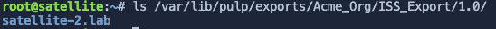
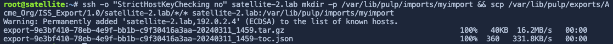
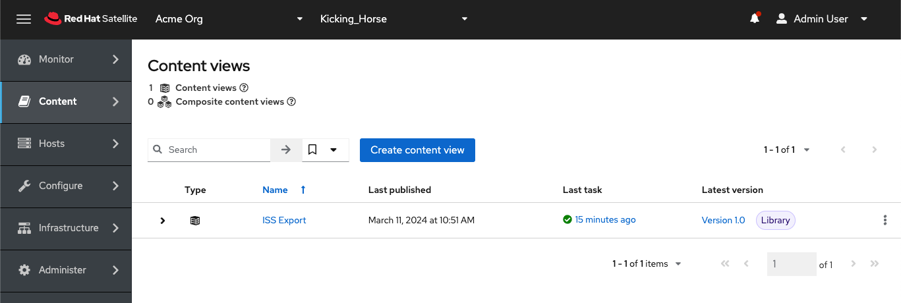

Inter-Satellite Sync (ISS) export sync exports software at the repository, content view, and lifecycle environment levels. In this assignment, we'll export the custom repo 'My custom repository' at the content view level from `satellite.lab` and import it into `satellite-2.lab`.

Create a new content view
=========================
In order to save time, we'll create a new content view with a minimal amount of software.

Copy and paste the following playbook into the `Satellite Server` terminal.

```
tee ~/createandpublishissexport.yml << EOF
---
- name: Create a new CV "ISS Export".
  hosts: localhost
  remote_user: root

  tasks:
  - name: "Create ISS Export content view"
    redhat.satellite.content_view:
      username: "admin"
      password: "bc31c9a6-9ff0-11ec-9587-00155d1b0702"
      server_url: "https://satellite.lab"
      name: "ISS Export"
      organization: "Acme Org"
      repositories:
        - name: 'My custom repository'
          product: 'My custom product'

  - name: "Publish and promote ISS Export to Library lifecycle environment"
    redhat.satellite.content_view_version:
      username: "admin"
      password: "bc31c9a6-9ff0-11ec-9587-00155d1b0702"
      server_url: "https://satellite.lab"
      organization: "Acme Org"
      content_view: "ISS Export"
      lifecycle_environments:
        - "Library"
EOF
```

This playbook creates a new content view called `ISS export` containing the repository `My custom repository`. Then the playbook publishes and promotes the content view `ISS Export` to the `Library` lifecycle environment.

Run the `createandpublishissexport.yml` playbook in the `Satellite Server` terminal.

```
ansible-playbook createandpublishissexport.yml
```

Create and Inter-Satellite Sync export
======================================

Now we'll export the content view `ISS Export` as an ISS export.

Copy and paste the following command into the `Satellite Server` terminal.

```
hammer content-export complete version --content-view "ISS Export" --version "1.0" --organization "Acme Org"
```

Copy the exported data to satellite-2.lab
=========================================

On `satellite.lab`, you can find the exported data in `/var/lib/pulp/exports/Acme_Org/Default_Organization_View/1.0/`.

```
ls /var/lib/pulp/exports/Acme_Org/ISS_Export/1.0/*/
```


In the `Satellite Server` terminal run the following command.

```
scp -o "StrictHostKeyChecking no" -rp /var/lib/pulp/exports/Acme_Org/ISS_Export/1.0/*/ satellite-2.lab:/var/lib/pulp/imports/Acme_Org/
```



This command will create a new directory on `satellite-2.lab` in `/var/lib/pulp/imports` called `Acme_Org` and copy all the exported data to it.

Import the exported data into satellite-2.lab
=============================================

We need to change the ownership of the data we just exported to the `pulp` account and group. Switch to the `Satellite Server 2` terminal and enter the following command.

```
chown -R pulp:pulp /var/lib/pulp/imports/Acme_Org/
```

In the `Satellite Server 2` terminal, run the following command.

```
hammer content-import version --organization "Acme Org" --path "/var/lib/pulp/imports/Acme_Org"
```

You can verify the result in the web gui with the same credentials as `satellite.lab`.

Username
```
admin
```

Password
```
bc31c9a6-9ff0-11ec-9587-00155d1b0702
```

Ensure that you are in `Acme Org` organization and the `Kicking Horse` location.



