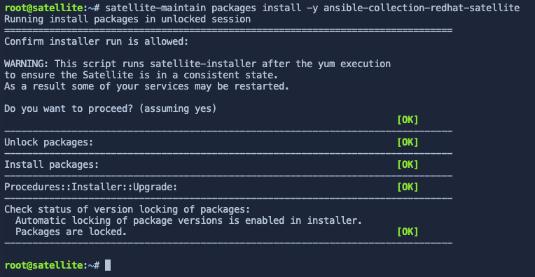

The first activity in this lab is to create an ansible playbook to automatically configure the Satellite server. Red Hat provides an Ansible collection to manage Red Hat Satellite configuration. Ansible playbooks are useful for building disaster recovery instances of Satellite, or any other task that requires a second Satellite server, including testing, and upgrades.

Documentation for the Satellite Ansible collection can be found [here](https://console.redhat.com/ansible/automation-hub/repo/published/redhat/satellite/docs) (Red Hat account required).

Install the Satellite Ansible collection
========================================
> [!NOTE]
> To reduce the amount of time waiting for for satellite operations to complete, the Satellite Ansible Collection has been preinstalled. Please read over this section and go to the next step.

> [!WARNING]
> Proceed to the next step.

>[!NOTE]
>For reference, the following command installs the Satellite Ansible Collection.
>
>```nocopy
>satellite-maintain packages install -y ansible-collection-redhat-satellite
>```



Create a playbook to configure the Satellite server
===================================================

The playbook below is simply an example.

> [!WARNING]
> Never put clear text passwords in your playbook.

Click this button [button label="Satellite Server"](tab-0) to switch to the `Satellite Server` terminal.


Next, click `run` below to write the following ansible playbook.

```bash,run
tee ~/config.yml << EOF
---
- name: Configure Satellite 6.16
  hosts: localhost
  remote_user: root

  tasks:
  - name: "Enable RHEL 9 BaseOS RPMs repository with label"
    redhat.satellite.repository_set:
      username: "admin"
      password: "bc31c9a6-9ff0-11ec-9587-00155d1b0702"
      server_url: "https://satellite.lab"
      organization: "Acme Org"
      label: rhel-9-for-x86_64-baseos-rpms
      repositories:
        - releasever: "9"

  - name: "Enable RHEL 9 AppStream RPMs repository with label"
    redhat.satellite.repository_set:
      username: "admin"
      password: "bc31c9a6-9ff0-11ec-9587-00155d1b0702"
      server_url: "https://satellite.lab"
      organization: "Acme Org"
      label: rhel-9-for-x86_64-appstream-rpms
      repositories:
        - releasever: "9"

  - name: "Satellite 6 client repository with label without specifying base arch"
    redhat.satellite.repository_set:
      username: "admin"
      password: "bc31c9a6-9ff0-11ec-9587-00155d1b0702"
      server_url: "https://satellite.lab"
      organization: "Acme Org"
      label: satellite-client-6-for-rhel-9-x86_64-rpms
      all_repositories: true
      state: enabled

  - name: "Create an activation key."
    redhat.satellite.activation_key:
      username: "admin"
      password: "bc31c9a6-9ff0-11ec-9587-00155d1b0702"
      server_url: "https://satellite.lab"
      name: "RHEL9"
      organization: "Acme Org"
      lifecycle_environment: "Library"
      content_overrides:
          - label: satellite-client-6-for-rhel-9-x86_64-rpms
            override: enabled
EOF
```

Here's what each of the tasks does.
1. The first two playbook tasks, `Enable RHEL 9 BaseOS RPMs repository with label` and `Enable RHEL 9 AppStream RPMs repository with label` will enable the RHEL 9 BaseOS and AppStream repositories. Labels don't contain space characters, unlike names.

2. The next task enables the `satellite-client-6-for-rhel-9-x86_64-rpms` repository. This task enables the repository without specifying base arch (as some repos do not require it). The Satellite 6 client repo contains software such as `Tracer` and `yggdrasild`. `yggdrasild` will be required later in the lab to enable Remote Execution Pull Mode.

3. The next task creates an `activation key` which is used to control access to repositories on Satellite. In this particular `activation key`, the Satellite 6 client repository is overridden to enabled, as well as the repos required for capsule configuration.

Execute the playbook
=====================

Execute the playbook by clicking on `run`.

```bash,run
ansible-playbook config.yml
```

>[!NOTE]
>The repositories configured have already been synchronized to save time.
