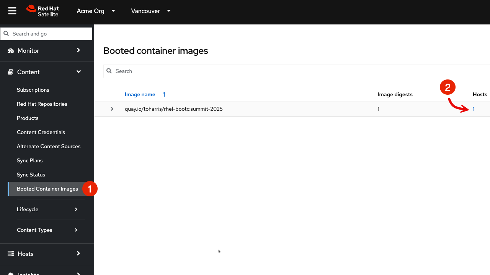

Image mode is a new approach to operating system (OS) deployment that lets users build, deploy, and manage Red Hat Enterprise Linux as a bootc container image.

It reduces complexity across the enterprise by letting development, operations, and solution providers use the same container-native tools and techniques to manage everything from applications to the underlying OS.

Red Hat Satellite 6.17 supports the management of RHEL image mode systems. In this assignment, we'll walk through the steps of registering and updating an image mode system.

Create a container repository in Satellite
===
Go to the Satellite Web UI.

You'll need the following credentials to log into the Satellite Web UI.

You can copy and paste each of them below.

```
admin
```

```
bc31c9a6-9ff0-11ec-9587-00155d1b0702
```

Do the following:
1) Click on `Products`.
2) Click `Create Product`.


Then we'll create a product called `bootc`.

1) Name the product `bootc`.
```text
bootc
```
2) Click on `Save`.


Create an activation key for our image mode host
===
In this lab environment, we have a ready-built image mode host named `rhel2`. We will generate an activation key and register `rhel2` to the Satellite server.

Go to the Activation Keys menu.


Click "Create Activation Key".


Do the following to create our activation key.
1) Name the key `bootc-summit`.
```text
bootc-summit
```
2) Click on "Library".
3) Select the "Default Organization View" Content View.
4) Click "Save".


Register the image mode host rhel2 to Satellite
===

Switch to the [button label="Satellite Server" background="#ee0000" color="#c7c7c7"](tab-0) terminal.


From the [button label="Satellite Server" background="#ee0000" color="#c7c7c7"](tab-0) terminal, run the following script.

> [!NOTE]
> You can automatically run the codeblocks in the terminal in focus by clicking on `run`.
> 

```bash,run
export regscript=$(hammer host-registration generate-command --activation-key bootc-summit --setup-insights false --insecure true --force 1)
ssh -o "StrictHostKeyChecking no" rhel2 $regscript
```

Here's what the successful registration looks like.


Verify image mode host details in Satellite
===
Let's explore the image mode information available in Satellite.

Navigate back to the Satellite Web UI.

1) Click on the "Booted Container images" menu.
2) You will be able to see that one image mode host is detected. Click on this link.



Next do the following.
1) Check the box to the left of the Power button.
2) Select "Schedule Remote Job".


Next we'll create a job to check bootc status.
1) Select the "Bootc" job category.
2) Select "Bootc Status - Script Default".
3) Click "Run on selected hosts".


Click on the "rhel2.lab" link.


Here you can see lots of information about the current status of the bootc system rhel2, including the image it was booted from.


Click on "rhel2.lab" to get to the host menu.


Click on the details tab.


Scroll down to the "Image mode details" card.


Here you can also see the "Running image" details which we will need to use in the next step. This information is populated only after the bootc status job is run or approximately every 4 hours.

Update the container image
===
The container image running on `rhel2` is stored in a quay.io registry. We want to modify that image. We'll use the host `rhel1` to pull down that container image from quay.io and update it.

Navigate to the [button label="rhel1" background="#ee0000" color="#c7c7c7"](tab-2) terminal.

```bash,run
cat <<EOT > Containerfile
FROM quay.io/toharris/rhel-bootc:summit-2025
RUN echo “Welcome to Summit 2025” > /etc/motd
EOT
```

This modification will create a new message-of-the-day "Welcome to Summit 2025" and will be displayed upon login.

Next, let's build the container from the ContainerFile with the command below.

```bash,run
podman build -f Containerfile -t satellite.lab/acme_org/bootc/rhel10beta:summit-2025
```

The command we just ran, applies the tag `satellite.lab/acme_org/bootc/rhel10beta:summit-2025` to our newly built container. The tag is the name assigned to the container image in the Satellite container registry.

Push the new container to Satellite's container registry
===
Now we'll push the updated container image from [button label="rhel1" background="#ee0000" color="#c7c7c7"](tab-2) to the Satellite container registry.

In the [button label="rhel1" background="#ee0000" color="#c7c7c7"](tab-2) terminal, log into Satellite container registry by running the following command.
```bash,run
podman login --tls-verify=false satellite.lab
```

Use the following credentials.

Admin
```bash,run
admin
```

Password
```bash,run
bc31c9a6-9ff0-11ec-9587-00155d1b0702
```

From `rhel1` we'll push our updated container image to Satellite.
```bash,run
podman push satellite.lab/acme_org/bootc/rhel10beta:summit-2025 --tls-verify=false
```

Enable unauthenticated pull operations for container images on Satellite
===

For the sake of simplicity, we want to enable unauthenticated pull for container images.

1) Go to the `Lifecycle Environments` menu.
2) Click on `Library`.


In the `Details` tab, do the following.
1) Check the `Unauthenticated Pull` checkbox.
2) Click `Save`.


Obtain the container image label.
===
Go to the `Products` menu. Click on the `bootc` product.


Click on `Container Image Tags`.


Click on the tag `summit-2025`.


Click on the `Lifecycle Environments` tab.


Note the `Published At` field on the menu. We'll need to copy and paste this value for our next step where we run a scheduled job to tell `rhel2` to use this new image.


```text
satellite.lab/acme_org/bootc/rhel10beta:summit-2025
```

Schedule a Remote Job to initiate an update of our image mode host rhel2
===
Let's schedule a remote job.
1) Go to all hosts and check the box for `rhel2`.
2) Click on `Schedule Remote Job` in the `Select Action` dropdown menu.


In the Category and template section of the Run job menu, do the following.
1) Select the `Bootc` Job category.
2) Select the `Bootc Switch - Script Default`.
3) Click `Next`.


In the Target hosts and inputs section of the Run job menu, do the following.
1) Paste the label of the updated container image in the target field.
```text
satellite.lab/acme_org/bootc/rhel10beta:summit-2025
```
2) Click `Run on selected hosts` to initiate the job.


We will ssh into `rhel2` from the Satellite server. Click on the [button label="Satellite Server" background="#ee0000" color="#c7c7c7"](tab-0) terminal and enter the following command.

```bash,run
ssh rhel2
```
Next, check on the status of our image mode host.

```bash,run
bootc status
```

This shows that we have a staged container image with the label `satellite.lab/acme_org/bootc/rhel10beta:summit-2025`. However, the image mode host `rhel2`, is still booted with the old image with the label `quay.io/toharris/rhel-bootc:summit-2025`.


Enter the following to reboot into the new container image.
```bash,run
reboot
```
Log back into `rhel2`. This may require a few attempts as it takes a couple minutes for `rhel2` to boot up.

```bash,run
ssh rhel2
```


Notice that the message-of-the-day now displays `Welcome to Summit 2025`.

And now check the bootc status.
```bash,run
bootc status
```


You can now see that the image mode host `rhel2` is now running our updated image labelled `satellite.lab/acme_org/bootc/rhel10beta:summit-2025` and you'll also see that you can roll back to the previous image if required.
